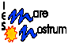
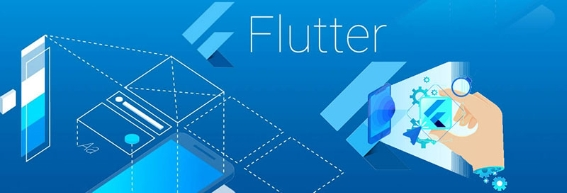
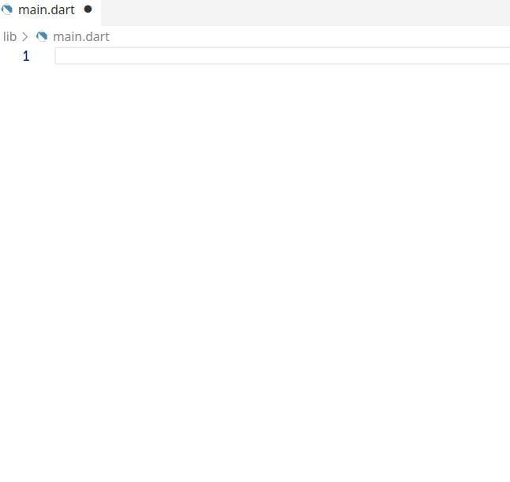

   


# Unidad 3. Widgets

En esta unidad empezamos a trabajar con la programación de interfaces gráficas con Flutter.  
Flutter sigue una **filosofía declarativa** a la hora de crear interfaces, a diferencia de la filosofía imperativa tradicional. El concepto alrededor del cual girará todo el desarrollo de interfaces en Flutter es el *widget*, que representará básicamente un componente gráfico. En los siguientes apartados veremos los diferentes tipos de widgets y algunos de los más importante o comunes.



[*1. Introducción a los Widgets*](#_apartado1)

[*2. Manos a la obra. Del Hola Mundo al Contador*](#_apartado2)

[*3.*	*El ciclo de vida de los widgets*](#_apartado3)

[*4. Widgets Básicos*](#_apartado4)

[*5. Widgets básicos. Contenedores y diseños*](#_apartado5)

[*6. Trabajando con recursos*](#_apartado6)

[*7. Trabajando con temas*](#_apartado7)


# <a name="_apartado1"></a>1. Introducción a los Widgets

## Introducción. Interfaces declarativas e imperativas.

El desarrollo tradicional de interfaces de usuario se ha basado en un **estilo imperativo**, en el que definimos qué deseamos que se represente a la interfaz y cómo queremos hacerlo. Tanto en aplicaciones de escritorio, como web o móviles solemos especificar la interfaz de usuario mediante ficheros basados en XML (XML puro, HTML, QML, etc.), que hay que transformar en elementos manipulables y enlazarlos de alguna manera con el código de la aplicación.

En contraposición a esta visión, el **paradigma declarativo**, presente en el mundo de la programación desde la década de 1950, propone un mayor nivel de abstracción, y se centra en el *qué* y no en el *cómo*. Aplicado al diseño de interfaces, la idea es que nos centremos en *describir* el estado *actual* de la interfaz, y dejemos para el framework la representación del mismo y las transiciones entre estados. Es decir, la interfaz de usuario se genera en función del estado que queremos representar:


La tendencia actual en el desarrollo de interfaces de usuario hacia interfaces declarativas surgió con frameworks como *React*, que introdujo los ficheros JSX, donde convivía código Javascript con HTML. Posteriormente, fue *Flutter* quien entró en acción en la Google I/O en 2017, y este cambio también ha llegado a Android nativo, con *Jetpack Compose* y las interfaces *componibles*, en iOS, con *SwiftUI*, e incluso en entornos como Unity, con *UIWidget*.

### Pensando de forma declarativa

Este cambio de tendencia requiere que cambiemos la forma de pensar a la hora de manipular las interfaces de usuario, y la introducción de una sintaxis declarativa para las mismas. Para ello haremos uso de una característica bien conocida de Dart: El paso de argumentos con nombre.

Veamos unos ejemplo simplificados en los que se trabaja con la **filosofía imperativa**. Imaginemos que queremos poner un texto de *Hola Mundo* centrado en pantalla. A grandes rasgos, con Android, por ejemplo tendríamos en el fichero de descripción de la interfaz el siguiente elemento de tipo `TextView`:

```xml
<TextView
  android:id="@+id∕miTextView"
  android:layout_width="wrap_content"
  android:layout_height="wrap_content"
  app:layout_constraintBottom_toBottomOf="parent"
  app:layout_constraintEnd_toEndOf="parent"
  app:layout_constraintStart_toStartOf="parent"
  app:layout_constraintTop_toTopOf="parent" ∕>
```

En el código de la aplicación, cuando inicializamos la interfaz, deberíamos buscar este `TextView`, haciendo uso del método `findViewById`, que devuelve un objeto de tipo `View`, que es quien representa los elementos gráficos, hacer un casting de esta vista a un `TextView`, y finalmente, acceder a la propiedad texto del `TextView` y modificarla. En Kotlin esto se haría con el siguiente código:

```kotlin
var myTextView=findViewById<TextView>(R.id.miTextView) elMeuTextView.text="Hola Mundo"
```

Si nos encontramos en desarrollo web, podríamos tener el siguiente elemento de tipo div en el código HTML (ya con las propiedades CSS añadidas para centrar este contenedor en horizontal y vertical):

```css
<div id="Contenedor"><∕div>
```

Que deberíamos manipular de forma parecida desde código Javascript para añadirle contenido, es decir, buscar el elemento de la interfaz, y modificarlo:

```javascript
let contenedor = document.getElementById("Contenedor"); contenedor.innerHTML = "Hola mundo!"
```

Pues bien, el planteamiento de este problema **de forma declarativa** sería: *Quiero un texto "Hola Mundo" centrado en pantalla*. En código, esto se traduciría en algo parecido a lo siguiente:

```dart
Center(
    child: Text(
        'Hola Món'
    )
)
```

Con lo que definimos un contenedor que centra los elementos, y dentro del cual tenemos un texto *Hola Mundo*. 

Si prestamos un poco de atención al código, veremos que no estamos introduciendo nada nuevo, sino que estamos utilizando constructores con parámetros posicionales y por nombre de diferente manera:

- El constructor del elemento `Center` recibe un único argumento con nombre: `child`, que indica qué elemento tiene dentro. 
- Este elemento interno es un `Text`, que recibe a su constructor como único argumento el texto *Hola Mundo*.

<link rel="stylesheet" href="css/style.css">

Disponemos de más informarción en los siguientes artículos:
{: .caja}
- Artículo [Start thinking declaratively](https://docs.flutter.dev/data-and-backend/state-mgmt/declarative), de la documentación de Flutter
- Article [Introduction to declarative UI](https://docs.flutter.dev/get-started/flutter-for/declarative), de la documentació de Flutter.
- Artículo [Flutter: La imposición del Declarative UI o UI as Code](https://medium.com/comunidad-flutter/flutter-la-imposici%C3%B3n-del-declarative-ui-o-del-ui-as-code-5e5ec099ba84), en Medium
- Artículo [Programación imperativa vs declarativa: Google Jetpack Compose](https://www.deloitte.com/es/es/services/consulting/blogs/todo-tecnologia/programacion-imperativa-vs-declarativa-google-jetpack-compose.html)


## Conceptos

### **Widgets**
El concepto fundamental en torno al cual gira todo el desarrollo de Flutter es el de **widget**. De hecho, en Flutter, salvo nuestras propias clases para mantener información y los modelos de datos, todo serán *widgets*.

Pero, ¿qué son entonces los *widgets*?  
Se trata de **clases de Dart cuyos constructores admiten tanto argumentos posicionales como argumentos con nombre, y que nos sirven para representar los elementos de nuestras interfaces**. En el ejemplo del apartado anterior, hemos presentado ya dos tipos de Widgets: `Center`, un *widget* de tipo contenedor y `Text`.

Los *widgets*, además, pueden componerse con el fin de crear una estructura en forma de árbol que representa la interfaz, y pueden ser widgets sin estado (*`Stateless`*) o con estado (*`Stateful`*), en función de si el widget necesita un estado asociado que pueda estar sometido a cambios.  
Por ejemplo, un botón o un texto estático, que no cambian, y pueden declararse como constantes, serían buenos candidatos para ser un widget sin estado, mientras que un componente que vaya a muestra el resultado de un llamamiento asíncrono, sería candidato a ser un widget con estado. Una diferencia importante entre ambos tipos es que los widgets con estado tienen la capacidad de *redibujarse* ellos mismos ante cualquier cambio de estado, mientras que los widgets sin estado no pueden hacerlo.

### **El árbol de Widgets**

Como acabamos de comentar, los widgets de una aplicación pueden componerse, de manera que se genere una relación jerárquica en forma de árbol. Podemos ver pues una aplicación en Flutter como un gran árbol que contiene todos sus widgets. Si en algún momento se produce un cambio en el estado de alguno de los widgets, el propio Flutter es quien se encarga de regenerar el subárbol afectado y redibujar la interfaz.

Vemos, a modo de ejemplo el código de una interfaz básica compuesta por una barra de aplicación, un cuerpo central y un botón de acción flotante, junto con el resultado de la ejecución y el árbol de widgets correspondiente:


Sin entrar en detalles que veremos posteriormente, vemos como el widget principal y la raíz del árbol de widgets es un widget de tipo `MaterialApp`. Dentro de éste, el componente `home` define otro widget de tipo `Scaffold`, que a su vez tiene tres nodos hijos más: el widget `Appbar`, en la propiedad `appBar`; el widget de tipo contenedor `Center`, en la propiedad `body` y el widget `FloatingActionButton` en la propiedad `floatingActionButton`. Al mismo tiempo, estos últimos nodos tienen también como nodos hijos diferentes widgets de tipo `Text` o `Icon`.

Como podemos imaginar, a medida que vamos añadiendo widgets a nuestra interfaz este árbol se irá haciendo más y más grande. En cuanto a la representación, es Flutter quien se encarga de generar y mantener este árbol, así como de realizar las animaciones correspondientes en cada cambio de estado, y por tanto de estructurar el árbol.

Uno de los aspectos más complejos que encontraremos a la hora de trabajar con Flutter será cómo gestionar la información y hacerla llegar de unas partes del árbol a otras, sobre todo si éstas se encuentran en ramas diferentes. 

En *el siguiente gist* podéis encontrar este código funcionando: 
[https://dartpad.dev/embed-flutter.html?id=a61b6f2bdc57458f6f7e074d031d3c77](https://dartpad.dev/embed-flutter.html?id=a61b6f2bdc57458f6f7e074d031d3c77)

<iframe
  src="https://dartpad.dev/embed-inline.html?id=a61b6f2bdc57458f6f7e074d031d3c77"
  width="100%"
  height="500px"
  frameborder="0">
</iframe>

<br>
<br>

# <a name="_apartado2"></a>2. Manos a la obra. Del Hola Mundo al Contador

Pasamos ya a la creación de nuestro primer proyecto con *Flutter*. Empezaremos con un sencillo *Hola Mundo* y veremos cómo podemos ir incorporándole widgets hasta convertirlo en una aplicación que gestiona un sencillo contador de clics, como la app de ejemplo de Flutter.

**Creación del proyecto**

En la primera unidad ya vimos cómo crear un proyecto con Flutter, tanto desde VSCode como desde la línea de órdenes. Recordemos los pasos:

- **Opción 1. Creación del proyecto de VSCode**
  
  - Tomamos `Ctrl+Shift+P` para abrir la paleta de órdenes, empezamos a escribir para buscar el orden *"Flutter: New Project"*, y configuramos nuestro proyecto con la siguiente configuración:
  
  - *¿Qué plantilla de Flutter?*:Application
  
  - Ubicación de la carpeta del proyecto: La que vosotros deseéis para guardar los proyectos de Flutter.
  
  - *Project Name*: *hola_mundo* (Recordemos que como todo proyecto Dart, no puede contener mayúsculas, pero sí el símbolo `_` ).
  
- Si consultamos la salida para el proyecto hola_mon en el VSCode, veremos que se ha lanzado lo siguiente: 


- **Opción 2. Creación desde el proyecto desde la línea de órdenes**

  - Desde una terminal, nos ubicamos en el directorio donde tenemos nuestros proyectos, y lanzamos la orden:

```
flutter create --overwrite hola_mundo
```

  - Como vemos, hemos indicado el nombre del proyecto, en lugar de ., para que se nos genere el directorio hola_mon para el proyecto.

Haya sido desde VSCode o desde consola, se nos ha generado un proyecto nuevo, con toda su estructura y para múltiples plataformas, como *android*, *ios*, *linux*, *macos*, *web* o *windows*.

Recuerde que por defecto se nos genera el proyecto para todas las plataformas posibles. Para restringir la aplicación sólo a unas plataformas concretas, haríamos uso de la opción --platforms. Por ejemplo:

```
flutter create --platforms linux,android,web hola_mon
```

Observe que no es necesario especificar la plantilla app de forma explícita porque es la plantilla predeterminada.


### **Ejecución de la aplicación predeterminada**

Recuerde que en la primera unidad también vimos cómo lanzar las aplicaciones Flutter, bien desde la línea de órdenes (ya sea una terminal del sistema como la integrada en el propio VSCode), como desde la paleta de órdenes de VSCode.

Para seleccionar el dispositivo donde ejecutar la aplicación, desde la paleta de órdenes (`Ctrl+Shift+P`) buscaremos el orden *Flutter: Select Device*, que nos permite elegir un dispositivo. Además, en la parte inferior derecha de la ventana de VSCode se nos muestra el dispositivo que tenemos configurado como predeterminado, y nos deja seleccionar también el dispositivo:


Una vez tenemos seleccionado el dispositivo podemos ejecutar la aplicación y depurarla con la tecla **F5.**

Una vez esté en ejecución, notaremos que se está depurando la aplicación porque se nos muestran en la parte superior los botones para la depuración, la barra de estado ha cambiado a color rojo, y se nos activa también la pestaña de depuración en la parte derecha, así como la consola de depuración.


Por otro lado, con el fin de ejecutar el proyecto desde la terminal, lo haremos, desde dentro del directorio de la aplicación con la orden:

```
flutter run
```

Si no tenemos ningún dispositivo en funcionamiento, se nos preguntará en qué dispositivo queremos lanzar la aplicación.

## Empezando por un "Hola Mundo"

La aplicación predeterminada que nos genera Flutter es una aplicación de contador, que combina diferentes widgets, tanto con estado como sin estado. Aunque esta aplicación nos servirá para ver muchas cosas, empezaremos con un código más sencillo, un *Hola Mundo*, que iremos haciendo crecer poco a poco.

Así pues, lo primero que haremos, será abrir el fichero `lib/main.dart`, y reemplazar todo su contenido por el siguiente código:

```dart
import 'package:flutter/material.dart';

void main() {
  runApp(
    const Text(
      'Hola Mundo',
      textDirection: TextDirection.ltr,
    ),
  );
}
```

El funcionamiento de este programa es el siguiente:

- Recordemos que una aplicación dart siempre busca ejecutar la función `main`, que en este caso, no recibe ningún argumento.
  
- Dentro del `main` se invoca a `runApp`, que es quien se encarga de ejecutar la aplicación Flutter.
  
- La función `runApp` recibe como único argumento un objeto de tipo *Widget*, que será el principal uso de la aplicación, el que debe renderizar. En este caso se trata de un `Text`, con el contenido *Hola Mundo* (primer argumento posicional), y que se muestra de izquierda a derecha (argumento opcional con nombre *textoDirection* con valor `TextDirection.ltr`). Sin este argumento con nombre, nos da el siguiente error porque no sabe cómo renderizar el texto:


Observamos que el widget `Text` se ha definido como constante, con `const`. En caso de no hacerlo así se nos mostraría el aviso *Prefer const with constante constructores*. En Flutter, los widgets que no van a ser modificados durante la ejecución (en este caso se trata de un texto creado directamente a partir de una cadena), conviene definirlos como constantes. De esta manera, indicamos a Flutter que un widget o un subárbol del árbol de widgets no debe reconstruirse, **mejorando así la eficiencia en el renderizado**.

La aplicación que hemos creado muestra el texto de *hola mundo* en la parte superior izquierda, por lo que, si lo ejecutamos desde un dispositivo móvil, aparece bajo la barra de notificaciones del sistema:


En algunos dispositivos móviles, según la configuración de la barra, es posible que este texto ni siquiera esté visible. 

Para centrar el texto, lo que haremos es incorporarlo dentro de un Widget de tipo `Center`. Podemos hacerlo directamente o **haciendo uso de las acciones de código que nos proporciona el plugin de Flutter para VSCode.** Para ver estas acciones, podemos hacer clic en la bombilla amarilla que aparece en el código, en la misma línea que se ubica el widget Text, o bien, situando el cursor encima del mismo y tomando Ctrl+.:


Como vemos, en la sección de *Más Acciones* se nos permite cubrir, o mejor *envolver* (*Wrap*) este widget con otro widget de tipo **contenedor**.

Una vez en el menú de las acciones de código, seleccionaremos la opción *Wrap with Center*, de manera que el código resultante sea el siguiente:

```dart
import 'package:flutter/material.dart';

void main() {
  runApp(
    Center(
      child: const Text(
        'Hola Mundo',
        textDirection: TextDirection.ltr,
      ),
    ),
  );
}
```

Este código nos mostrará de nuevo el Warning *"Use const..."*, ya que el Widget `Center` que acabamos de introducir tampoco cambiará durante la ejecución de la aplicación y, por tanto, debe declararse como constante:

```dart
import 'package:flutter/material.dart';

void main() {
  runApp(
    const Center(
      child: Text(
        'Hola Mundo',
        textDirection: TextDirection.ltr,
      ),
    ),
  );
}
```

Como vemos, hemos eliminado también el `const` de delante del Texto, ya que cuando definimos un *Widget* como constante, los widgets que descienden de él en el árbol de widgets también lo serán. En este caso, si no eliminamos el `const` del `Text`, se nos mostrará un nuevo Warning *Unnecessary 'const' keyword*. Así pues, la palabra `const` debe declararse lo más arriba posible en el árbol de widgets.

Podemos verlo aquí:


Con ello, ya tendremos el texto centrado en la pantalla.

{: .caja}
Si no nos avisa del tema de los const podemos añadir estas lineas al fichero `analysis_options.yaml`:

```yaml
include: package:flutter_lints/flutter.yaml

...
linter:
  rules:
    prefer_const_constructors: true
    prefer_const_literals_to_create_immutables: true
...
```

### **Creando nuestro widget**

La función `runApp` que invocamos desde la función `main` se encarga de establecer el principal uso de la aplicación y vincularlo a la pantalla.

Lo que hemos hecho hasta ahora es definir este widget directamente en la llamada, pero generalmente, lo que se hace es definirlo de manera independiente, como un widget personalizado.

Para crear un widget personalizado, es necesario crear una clase que descienda bien de la clase abstracta `StatefulWidget` si queremos que siga un **widget con estado**, o bien de la clase abstracta `StatelessWidget`, si queremos que sea un **widget sin estado**.

Para definir el widget `MyApp` como un widget sin estado declararíamos la clase:

```dart
class MyApp extends StatelessWidget {}
```

Esta declaración de la clase, tal y como está, nos da el error *non_abstract_class_inherits_abstract_member*. Para ver la descripción del error dejamos el puntero del ratón encima, y se nos mostrará una ventana parecida a ésta:


Como vemos, nos dice que, si extendemos una clase de la clase *`StatelessWidget`*, debemos proporcionar una implementación al método *`build`*. Si seleccionamos la opción de *Corrección rápida (Quick Fix)* se nos mostrará un nuevo diálogo con las posibles correcciones. Seleccionaremos la primera *Create 1 missing Override*.


El código generado será:

```dart
class MyApp extends StatelessWidget {
  @override
  Widget build(BuildContext context) {
    // TODO: implement build
    throw UnimplementedError();
  }
}
```

Como vemos, el método `build` es un método que devuelve un `Widget`, y como su nombre indica, será el método que **construirá** éste. 

Observamos también que este método recibe un argumento `context` de tipo `BuildContext`. Vamos a pararnos un poco en este concepto.

### ¿Qué es el contexto?

Cuando hablamos del contexto en general hacemos referencia a la situación en que ocurre cierto acontecimiento. En Android, por ejemplo, este hace referencia al estado actual de una aplicación u objeto, a partir del cual podemos obtener cierta información sobre la aplicación, y nos permite acceder a determinados recursos, bases de datos o preferencias.

En Flutter, el `BuildContext` literalmente sería el *contexto de construcción*, es decir, el estado de la aplicación en el momento de construir el widget. Este estado viene representado por el camino en el árbol desde la raíz hasta el *nodo* que estamos creando, de manera que, mediante este camino, podemos obtener datos de los nodos superiores.

<hr>

Disponemos de más información sobre el contexto en los siguientes artículos:
- Sobre el BuildContext: [What is BuildContext in Flutter?](https://www.educative.io/answers/what-is-buildcontext-in-flutter)
- Sobre el context en Android: [Article Context in Android : Application Context vs Activity Context](https://www.oodlestechnologies.com/dev-blog/context-in-android-:-application-context-vs-activity-context/)
  
<hr>

<br>

Siguiendo con nuestro ejemplo práctico, ahora habría que añadir el código para construir el soporte principal de la aplicación dentro de este método `build`. Este método, como hemos dicho, construirá la interfaz principal en función de otros Widgets. Concretamente, devolverá el `Center` que estábamos proporcionándole directamente a `runApp`:

<br>

```dart
class MyApp extends StatelessWidget {
  @override
  Widget build(BuildContext context) {
    return const Center(
        child: Text(
          'Hola Mundo', 
          textDirection: TextDirection.ltr
        )
      );
  }
}
```

Además, ahora deberemos modificar el método `main` y proporcionarle al método `runApp` una instancia de nuestro widget:

```dart
void main() {
  Widget widgetPrincipal = MyApp();
  runApp(widgetPrincipal);
}
```

Que podemos simplificar con:

```dart
void main() {
  runApp(MyApp());
}
```

E incluso, expresar el método `main` como función flecha:

```dart
void main() => runApp(MyApp());
```

Observad que para crea la instancia de `MyApp` solo es necesario llamar al constructor, sin hacer uso de la palabra `new`. De hecho, si lo hacemos nos mostraría el aviso *Unnecessary new keyword*.

Con esto ya hemos creado nuestra primera clase de tipo Widget y la hemos utilizado como widget principal de la aplicación. Sin embargo, sigue apareciéndonos un aviso sobre la clase `MyApp`. Si nos situamos encima, veremos que este aviso nos indica `Use key in widget constructors`.


Si aceptamos la sugerencia de corrección rápida *Add key to constructores*:


Nos creará un constructor en nuestro widget con una clave opcional:
```dart
const MyApp({super.key});
```

Esta clave se utilizará con el fin de identificar de manera más eficiente el widget dentro del árbol, de forma parecida a como se usaría un *id* en las vistas de Kotlin o en HTML.

Esta nueva corrección nos generará otro aviso de tipo *Prefer const with constant constructors*, que ya conocemos, y que nos sugiere que, dado que el widget MyApp no sufrirá cambios durante la ejecución del programa, lo definimos como constante.

Finalmente, nuestro código quedaría como:

```dart
import 'package:flutter/material.dart';

void main() {
  runApp(const MyApp());
}

class MyApp extends StatelessWidget {
  const MyApp({super.key});

  @override
  Widget build(BuildContext context) {
    return const Center(
        child: Text('Hola Mundo', textDirection: TextDirection.ltr));
  }
}
```

### **La acción de código *Extract Widget***
Una acción de código muy interesante, y que nos será de gran utilidad cuando los widgets que vamos creando vayan creciendo es la de extracción de widgets. Esta acción nos permitirá extraer un nuevo widget a partir de una parte del árbol que estamos construyendo.

Para aplicarlo al ejemplo que estamos haciendo, volvemos al código inicial donde todavía no habíamos generado nuestro widget personalizado:

```dart
void main() {
  runApp(
    const Center(
      child: Text(
        'Hola Mundo',
        textDirection: TextDirection.ltr,
      ),
    ),
  );
}
```

Y ubicamos el cursor encima del Widget Center. Veremos que se nos muestra a la izquierda la bombilla para mostrar las acciones de código. Hacemos clic en ella (o con *Ctrl+.*), y en el menú contextual podemos seleccionar la opción *Extract Widget*.


Que nos mostrará un diálogo para añadir el nombre del widget. Escribimos MyApp:


Y automáticamente nos generará todo el código para nosotros, a lo que sólo nos hará falta indicar el `const` ante `MyApp`:

```dart
void main() {
  runApp(
    MyApp(),
  );
}

class MyApp extends StatelessWidget {
  const MyApp({
    super.key,
  });

  @override
  Widget build(BuildContext context) {
    return const Center(
      child: Text(
        'Hola Mundo',
        textDirection: TextDirection.ltr,
      ),
    );
  }
}
```

Podemos verlo en esta animación:


### **Creación de Widgets personalizados y parametrizados**

Como sabemos, un *widget* es también una clase, de manera que podemos declarar en ella tantas propiedades como necesitamos, y además, proporcionarle valor mediante su constructor.

Por ejemplo, vamos a hacer un widget sin estado muy sencillo, en el que definimos una propiedad llamada `propiedadTexto`. El método `build` que construye el widget, simplemente devolverá un widget de tipo `Text` con el valor de la propiedad de texto:

```dart
class MiWidgetPersonalizado extends StatelessWidget {
  final String? propiedadTexto;

  const MiWidgetPersonalizado({required this.propiedadTexto, super.key});

  @override
  Widget build(BuildContext context) {
    return Text("$propiedadTexto");
  }
}
```

Observemos que la variable `propiedadTexto` se ha definido como `final`, para poder definir al constructor como constante, de manera que el renderizado sea más eficiente. Si esta propiedad pudiera variar en el futuro, no podríamos definirla como `final` y el constructor no se podría definir como `const`. 

Veamos también que la propiedad `propiedadTexto` se inicializa en el propio constructor, de forma simplificada, y como argumento con nombre, junto con la clave (`key`) del widget, y que se nos incorpora automáticamente si generamos el widget a partir de los *snippets*. Aunque es posible eliminar la clave del constructor, Flutter nos recomienda siempre utilizar una.

Con el fin de hacer uso de este widget, simplemente invocaríamos a su constructor tantas veces como fuera necesario, proporcionándole el valor de la propiedad. Por ejemplo, para incorporar un par de widgets en forma de columna, haríamos:

```dart
Column(
  children: const [
    MiWidgetPersonalizado(propiedadTexto: "Text 1"),
    MiWidgetPersonalizado(propiedadTexto: "Text 2"),
  ],
)
```

Como veis, sólo hay que proporcionar la propiedad `propiedadTexto`. La clave `key` será generada por el propio Flutter en función del tipo del widget y otros factores. 

Si lo deseamos, también podemos proporcionar nosotros esta clave, mediante el constructor Key y proporcionándole un string:

```dart
Column(
  children: const [
    MiWidgetPersonalizado(
        propietatText: "Text 1", key: Key("clau 1")),
    MiWidgetPersonalizado(
        propietatText: "Text 2", key: Key("clau 2")),
  ],
)
```

Como veréis, en este widget `Column`, hemos utilizado la palabra `children` en lugar de `child`, y además, le proporcionamos una lista de widgets, en lugar de uno solo. Esta es la forma que tienen de trabajar los widgets que admiten múltiples widgets hijos, como es esta `Column`, que organiza los widgets uno bajo del otro. Con estos widgets, aunque sólo haya un hijo, habrá que indicar el parámetro children en lugar de child y pasarle la lista de valores.

<br>

## Aplicaciones Material Design

Material Design es un sistema de diseño creado por Google en 2014, que incluye guías de diseño para mejorar la experiencia de usuario e implementaciones de componentes de interfaces, aplicables tanto para Android como para Flutter y la web.

En nuestros proyectos, hemos incluido la librería de componentes de Material, pero no hemos generado una aplicación *Material* como tal. Para ello, Flutter nos ofrece el widget `MaterialApp`, que nos sirve como base para aplicaciones de tipo *Material*, ofreciéndonos una serie de elementos de interfaz y de estilo comunes en este tipo de aplicaciones.

Entre las diferentes propiedades del widget MaterialApp, destacamos:

- **theme**: que nos sirve para definir el tema de la aplicación. En versiones de Flutter previas a la 3.16 (noviembre de 2023) se utilizaba Material 2, con un tema basados en tonalidades de azul. A partir de la versión 3.16, se hace uso de Material 3 de manera predeterminada, con un tema más minimalista si cabe. Además, con la llegada de Material You, se puede personalizar el tema de la aplicación con colores dinámicos que se generan a partir del fondo de pantalla del usuario.
  
- **debugShowCheckedModeBanner**: Un booleano que nos indicará si queremos mostrar el banner de depuración que nos aparece en la parte superior derecha de las aplicaciones, y que de manera predeterminada toma el valor *true*. Si queremos eliminar este banner, solo tenemos que establecer a *false* esta propiedad.
  
- **title**: Con el nombre de la aplicación que se mostrará al usuario.
  
- **home**: Que define el punto de entrada a la aplicación. Profundizaremos más en esta propiedad cuando veamos rutas a la siguiente unidad.

El plugin *Flutter Snippets* incluye un *snippet* para generar una aplicación *Material* básica. Si borramos el contenido que teníamos y escribimos la abreviación *mateapp*, podremos seleccionar este snippet:


Que nos generará todo el esqueleto de la aplicación:

```dart
import 'package:flutter/material.dart';

void main() => runApp(const MyApp());

class MyApp extends StatelessWidget {
  const MyApp({super.key});

  @override
  Widget build(BuildContext context) {
    return MaterialApp(
      title: 'Material App',
      home: Scaffold(
        appBar: AppBar(
          title: const Text('Material App Bar'),
        ),
        body: const Center(
          child: Text('Hello World'),
        ),
      ),
    );
  }
}
```

Podemos verlo en esta animación:



### **El widget Scaffold**

Como vemos, la aplicación Material que hemos generado con el snippet incluye el título de la aplicación (`title: 'Material App'`) y el punto de entrada a la misma (`home: Scaffold(...)`). 

Este widget `Scaffold` que utiliza como punto de entrada implementa la estructura de diseño visual básico de Material Design, y proporciona varias APIs para gestionar la navegación. Por defecto, como ya anticipamos en el apartado introductorio, este `Scaffold` contiene de manera predeterminada los dos elementos siguientes:

- `appBar`: Con la barra superior de la aplicación, y que consiste en un widget de tipo `AppBar`. Este widget admite muchas personalizaciones, aunque aquí, de momento, sólo se añade el título.
  
- `body`: Con el cuerpo o contenido principal de la aplicación, que contiene por defecto un contenedor de tipo `Center` con un `Text`.

Como vemos, para adaptar esta estructura a nuestro ejemplo, solo tendremos que cambiar el texto *Hello World* por *Hola Mundo!*. Además, al tratarse de una aplicación `MaterialApp`, ésta ya define en el estilo los textos con la propiedad `textDirection`, de manera que ya no será necesario establecer esta propiedad de manera explícita. En este ejemplo, también hemos modificado el texto de la barra superior, con el contenido *"Texto de la barra"*.

Así pues, nuestro código podría quedar de la siguiente forma:

```dart
import 'package:flutter/material.dart';

void main() => runApp(const MyApp());

class MyApp extends StatelessWidget {
  const MyApp({super.key});

  @override
  Widget build(BuildContext context) {
    return MaterialApp(
      title: 'Aplicación Material',
      home: Scaffold(
        appBar: AppBar(
          title: const Text('Texto de la barra'),
        ),
        body: const Center(
          child: Text('Hola Mundo'),
        ),
      ),
    );
  }
}
```


Como podemos observar, nos aparece la etiqueta *Debug en* la parte superior derecha. Si queremos que ésta no se muestre, haremos uso del parámetro `debugShowCheckedModeBanner` del widget `MaterialApp` de la siguiente manera:

```dart
MaterialApp(
      title: 'Aplicación Material',
      debugShowCheckedModeBanner: false,
      home: Scaffold(..))
```

Recordemos que los parámetros que proporcionamos al constructor son parámetros por nombre, no posicionales, de manera que no importa el orden en que añadimos estos.


{: .caja}
- [Documentación oficial sobre Material en Flutter](https://docs.flutter.dev/ui/widgets/material)  
- Artículo [Building user interfaces with Flutter](https://docs.flutter.dev/ui), de la documentación oficial de Flutter.
- Referencia de la [clase MaterialApp en la API de Flutter](https://api.flutter.dev/flutter/material/MaterialApp-class.html)
- Sitio Web de [Material Design](https://m3.material.io/)
    
  

<br>

## Organizando el código

Hasta ahora hemos estado utilizando un único fichero para todo el código de nuestra aplicación, que gestiona la parte lógica, el estado o el aspecto. Lo más recomendable, sobre todo cuando la aplicación crece es organizar el código fuente en diferentes ficheros y carpetas, según su funcionalidad. De esta manera, nuestras aplicaciones serán fáciles de mantener y apropiadas para trabajar en equipo.  

Una práctica habitual es crear una carpeta `screens` dentro del directorio `lib` del proyecto para ubicar las diferentes *pantallas* de la aplicación. Para ello, podemos hacerlo bien desde la terminal, o creando una nueva carpeta a través de la vista de ficheros de VSCode.

Recordemos que el código fuente de nuestra aplicación se ubica en el directorio `lib`, y dentro del mismo, podemos crear tantos ficheros y carpetas como deseamos, de forma libre, o siguiendo algún patrón arquitectónico (MVC, MVVM, BLoC, Clean, etc.).

En nuestro ejemplo, estamos haciendo una primera organización del código sencilla, de manera que solo hemos creado una carpeta para las pantallas que hemos llamado `screens`, pero podría haberse llamado de cualquier otra manera, como `views` o `ui` por ejemplo.

En la carpeta `lib/screens`, crearemos un fichero para la pantalla de inicio, que llamaremos, ejemplo `home_screen.dart`, y a la que añadiremos la clase `MyApp` que habíamos creado renombrándoloa por `HomeScreen`. Quedaría:

```dart
/* 
Fichero lib/home_screen.dart
Contiene la pantalla de inicio de la aplicación
*/

import 'package:flutter/material.dart';

class HomeScreen extends StatelessWidget {
  const HomeScreen({super.key});

  @override
  Widget build(BuildContext context) {
    return MaterialApp(
      title: 'Aplicación Material',
      debugShowCheckedModeBanner: false,
      home: Scaffold(
        appBar: AppBar(
          title: const Text('Texto de la barra'),
        ),
        body: const Center(
          child: Text('Hola Mundo'),
        ),
      ),
    );
  }
}
```

Y dejaríamos el fichero `lib/main.dart` con el código:

```dart
import 'package:flutter/material.dart';
import 'package:hola_mon/screens/home_screen.dart';

void main() => runApp(const HomeScreen());
```

Como podremos comprobar, si reemplazamos `MyApp()` por `HomeScreen()` nos importa automáticamente el fichero `home_screen.dart`. Hay que notar que en la ruta al fichero incluye el nombre del paquete `hola_mon`, y la subcarpeta *screens*, pero no la carpeta *lib*, ya que se entiende que es ahí donde se ubica el código.

<br>

## Convirtiendo el Hola Mundo en la App de contador

Vamos a pasar ya de este sencillo *Hola Mundo* a crear la aplicación de Contador. Para ello, será necesario básicamente modificar el diseño para añadir el número de *clicks* que se han hecho y el botón para hacer el incremento. Además, habrá que añadir esta funcionalidad al mismo botón.

### **Añadiendo el número de clicks**

Para añadir el número de *clicks* debemos introducir antes un tipo especial de widgets, los *contenedores*, que sirven para organizar un conjunto de *widgets* atendiendo a diferentes tipos de organización (*layout*). Estos *widgets de diseño* suelen clasificarse en líneas generales en quienes tienen un único widget hijo, y que sirven para determinar cómo se muestra éste, y los que tienen más de un widget hijo, que sirven para organizar diferentes widgets dentro de otro.

El widget que usaremos pertenece a este segundo grupo y es el widget `Column`, que organiza diferentes widgets hijos en dirección vertical.

La principal diferencia entre un widget contenedor **con un solo hijo** y quienes tienen **varios hijos** es que en los primeros definimos la propiedad `child`, con un único widget, y en los segundos la propiedad `children`, que se inicializa con una lista de widgets.

Así pues, lo que vamos a hacer ahora es añadir este contenedor `Column` dentro del widget `Center` que ya teníamos, de manera que la columna quede centrada. Podemos hacerlo escribiendo directamente el código, o bien *envolviendo* el widget `Text` que teníamos como hijo con el contenedor `Column`. Para ello, nos ponemos de nuevo encima del texto, y hacemos clic en la bombilla para ver el menú contextual y escoger la opción *Wrap with Column*. Cuando lo hagamos, nos añadirá el widget `Column`, con la propiedad `children`, y como valor de ésta una lista con el `Text`. 


Con ello, sólo nos queda modificar el primer texto, y añadir un segundo con el valor del contador. El código quedaría así:

```dart
body: const Center(
  child: Column(
    children: [
      Text('Hola Mundo'),
      Text('0'),
    ],
  ),
)
```

El resultado de este código nos mostrará los dos textos alineados en forma de columna, pero quizás no es el resultado que deseábamos, ya que lo hace en la parte superior de la pantalla:


Esto se debe a que el widget de la columna sí está centrado, pero ocupa todo el espacio disponible del widget `Center`, y dentro de éste, está apilando los widgets de arriba hacia abajo. Esta forma de organizar los widgets y el espacio restante dentro de la columna se puede realizar de diversas maneras mediante la propiedad `mainAxisAlignment` del widget `Column`. Por ejemplo, y para centrar los widgets:

```dart
Column(
    mainAxisAlignment: MainAxisAlignment.center,
    ...
)
```

`MainAxisAlignement` (con mayúscula) es un enumerado (`enum`) que contiene los posibles valores para esta propiedad. Además de `center` tenemos valores como `start` (valor por omisión), `end`, `spaceAround`, `spaceBetween` o `spaceEvenly`.

Gráficamente, estos valores tienen el siguiente efecto:


### **Modificando las propiedades de los textos**

El widget `Text` requiere un primer argumento posicional, con el texto a mostrar, pero también admite después varios argumentos con nombre que sirven para definir las propiedades del texto. Una de estas propiedades es `style` que sirve para establecer el estilo, y viene definido por la clase `TextStyle`, en la que podemos definir varias propiedades. Una de estas propiedades es `fontSize`, que determinará el tamaño de la fuente en píxeles.

Nuestro texto podría quedar de la siguiente manera:

```dart
Text(
    '0',
    style: TextStyle(fontSize: 50),
)
```

### **Añadiendo el botón de acción flotante**

Para incrementar el contador, vamos a hacer uso de un botón de acción flotante (*Floating Action Button*). El widget `Scaffold`, que nos proporciona el diseño básico de una aplicación `Material`, además de los argumentos con nombre `appBar` y `body`, admite, entre otros más, el argumento `floatingActionButton`. Este argumento puede ser cualquier widget, pero generalmente será un objeto de tipo `FloatingActionButton`, definido en la librería `Material`.

Este botón necesitará una propiedad `onPressed`, que contendrá una función anónima de `callback` (o función flecha) que se ejecutará cada vez que se haga *click* en él. Si este método no contuviera código, podríamos definir el botón como constante. 

Con el fin de especificar el contenido del botón, disponemos de la propiedad `child` que generalmente contendrá un widget de tipo `Icon`, que requiere un primer argumento posicional con el icono a mostrar. En nuestro caso, utilizaremos el icono `Icons.add`, que añade el símbolo "+". El código resultante, de momento con el callback vacío será:

```dart
Scaffold(
        appBar: ...,
        body: ...,
        floatingActionButton: FloatingActionButton(
          onPressed: () => {},
          child: const Icon(Icons.add),
        ),
      ),
```


Bien, con esto ya tenemos el diseño completo del contador. Ahora nos quedará añadir la funcionalidad.


### **Añadiendo funcionalidad al contador. Primeros problemas.**

La funcionalidad será bastante sencilla, y consistirá en definir una variable que almacene el valor del contador e incrementar este valor cada vez que se haga *click* en el botón de acción flotante. Además, habría que cambiar el texto "0" para que mostrara este valor. El código quedaría con los siguientes cambios (veamos que hemos tenido que cambiar algunos `const` porque ahora ya hay un elemento que no será constante ):

```dart
 @override
  Widget build(BuildContext context) {
    int contador = 0;

    return MaterialApp(
      ...
      home: Scaffold(
        appBar:...,
        body: Center(
          child: Column(...
            children: [
              const Text('Valor del contador'),
              Text(
                '$contador',
                style: const TextStyle(fontSize: 50),
              )
            ],
          ),
        ),
        floatingActionButton: FloatingActionButton(
          onPressed: () {
            contador++;
            debugPrint('[LOG]: Actualizando contador a $contador');
          },
          child: const Icon(Icons.add),
        ),
      ),
    );
  }
```


Vemos algunos detalles de este código:

- Hemos definido el contador en el método `build` del widget.
  
- Hemos tenido que eliminar el `const` del elemento `Column`, ya que ahora sólo será constante el primer `Text` y el estilo del segundo.
  
- Hemos añadido el valor del contador en el segundo `Text`, haciendo uso de la interpolación de Strings (añadiendo la variable dentro de un string e interpolándola con el `$`).
  
- Hemos incorporado el código para incrementar el contador al método `onPressed`, y además, hemos añadido una orden `debugPrint` para mostrar las actualizaciones por la consola. Además, como ahora hay dos instrucciones dentro del callback, en lugar de una función flecha, hemos expresado el callback como función anónima.

Si ahora volvemos a ejecutar nuestro programa veremos cómo, aunque el mensaje de *Log* que hemos añadido sí muestra correctamente el valor del contador, **éste no se actualiza a la interfaz**.

### **Widgets con estado y sin estado**

Este comportamiento se debe a que hemos hecho uso de un widget sin estado (`HomeScreen` hereda de `StatelessWidget`), y tal y como comentamos en la introducción, los widgets sin estado no tienen la capacidad de redibujarse por ellos mismos.

La solución es hacer uso de un widget con estado, de manera que éste se pueda redibujar con cada modificación.

*¿Significa esto que los widgetss sin estado no aprovechan para reflejar el estado de nuestra aplicación?*

No. Como veremos más adelante, podemos hacer uso de gestores de estados, de manera conjunta con widgets sin estado, de manera que los widgets se actualizan de manera *reactiva* cuando se modifique el estado, pero sin mantener un estado por sí mismos.

*Entonces, ¿cuándo convendrá hacer uso de un tipo de widget u otro?*

Generalmente, cuando hagamos uso de un gestor de estados, podremos hacer uso de widgets sin estado, que se actualizan automáticamente según el estado. Ahora bien, cuando necesitamos que un widget pueda interactuar con el usuario, solemos hacer uso de widgets con estado, como es el caso de este contador.

### **Añadiendo widgets con estado**

Los widgets con estado, como su propio nombre indica, tienen la propiedad de estar asociados a un *estado*, entendiendo este *estado* como un conjunto de variables con valores que pueden mutar.

Antes de modificar nuestro código, vemos **qué estructura** presenta un widget con estado.

El snippet `statefulW`, nos proporciona una plantilla básica para estos widgets, que podemos personalizar con el nombre que deseamos. 


El código que nos ha quedado después de renombrar este widget como MyWidget ha sido el siguiente:

```dart
class MyWidget extends StatefulWidget {
  const MyWidget({super.key});

  @override
  State<MyWidget> createState() => _MyWidgetState();
}

class _MyWidgetState extends State<MyWidget> {
  @override
  Widget build(BuildContext context) {
    return Container();
  }
}
```

Veamos algunos detalles:

- En primer lugar, hay que notar que ahora estamos definiendo **dos clases**: Una para el widget en sí (`MyWidget`) y otra, que representa su estado (`_MyWidgetState`). Notemos que esta segunda clase empieza con `_` para indicar que es privada.
  
- La clase que define el widget (`MyWidget`) hereda ahora de `StatefulWidget`, indicando así que contiene un estado mutable. El constructor, al igual que a los widgets con estado, para poder referenciarse dentro del árbol de widgets, tendrá también una propiedad que será la clave (`key`)

- La clase `MyWidget` ya no dispone del método `build`, sino que sobreescribe el método `createState()` de la clase `StatefulWidget`. Este método será invocado por el framework cuando el widget se inserta por primera vez en el árbol de widgets, y creará una instancia del estado `_MyWidgetState()`. Esta instancia se reutilizará cada vez que se redibuje el widget.
  
- La clase que representa el estado (`_MyWidgetState`) será la encargada ahora de sobreescribir el método `build`, y por lo tanto de *redibujar* el widget.

Bien, vamos ahora a modificar nuestro código, y para ello, disponemos de una acción de código que nos ayudará a convertir un widget sin estado a un widget con estado. Si nos ubicamos encima la definición de la clase `HomeScreen` y hacemos uso de la bombilla que aparece al lado, o directamente hacemos click en `Ctrl + .`, nos mostrará esta opción:


Así pues, hacemos este cambio y **añadimos el contador, ahora sí como propiedad de la misma clase**, en lugar de definirla dentro del método build:

```dart
class _HomeScreenState extends State<HomeScreen> {

  int contador = 0;

  @override
  Widget build(BuildContext context) {
    return MaterialApp(...)
    ..
  }
```

Si ejecutamos ahora la aplicación, veremos que tampoco se modifica la interfaz. Esto se debe a que todavía nos queda un último detalle, y es **notificarle a Flutter que hemos modificado el estado interno del widget**, y que, por lo tanto, debe redibujar éste. Esto se consigue con la función `setState()`, a la que le proporcionamos una función anónima con el código que modifica el estado. El código resultante para, tanto, para el evento onPressed del *Floating Action Button* quedará de la siguiente forma:

```dart
onPressed: () {
   setState(() {
        contador++;
    });
    print('[LOG]: Actualizando contador a $contador');
}
```

Con esto, finalmente ya tenemos nuestra aplicación de contador funcionando.

También podríamos haber hecho los cambios fuera de la función anónima de setState:

```dart
onPressed: () {
    contador++;
    print('[LOG]: Actualizando contador a $contador');
  setState(() {});
}
```

### En resumen

En este apartado, hemos visto de forma práctica cómo crear un proyecto nuevo con un sencillo texto centrado de *Hola Mundo*, y lo hemos ido modificando hasta convertirlo en un contador parecido al que aparece en la aplicación predeterminada.

Con esto, y a pesar de no haber entrado aún en profundidad con los widgets, hemos aprendido algunas cosas interesantes, como:

- **Crear proyectos Flutter**, tanto desde la línea de órdenes como desde VSCode, así como especificar plataformas concretas para la aplicación,
  
- **Ejecutar nuestro proyecto**, tanto desde la línea de órdenes como desde VSCode,
- Las funciones `main` y `runApp` en un proyecto Flutter.
- Cuando tenemos que utilizar widgets como constantes o no.
- Cómo crear widgets personalizados mediante *snippets*.
- Qué es el `BuildContext` y qué relación tiene con el árbol de Widgets.
- Cómo extraer con VSCode un widget de una estructura anidada como widget personalizado.
- La estructura de una aplicación *Material Design*,
- L'estructura del widget `Scaffold`,
- Cómo organizar el código en carpetas,
- Cómo organizar contenido en columnas con el widget `Column`,
- Añadir un botón de acción flotante e implementar su funcionalidad,
- La diferencia entre widget `Stateless` y `Stateful`, y cómo definir el estado,

## Ejercicio voluntario

**Añade otro botón para decrementar el contador y otro para resetear su valor a 0.**

- Claves para la resolución:

  - El componente `floatingActionButton` del `Scaffold` no necesariamente debe tener un componente de tipo `FloatingActionButton`, sino que puede contener, por ejemplo un contenedor de tipo `Row` o `Column`, y dentro de él podemos añadir varios botones.
  - Si deseas modificar la posición del componente `floatingActionButton`, podéis utilizar la propiedad del `Scaffold` `floatingActionButtonLocation`, cuyos posibles valores se encuentran en `FloatingActionButtonLocation`.


<br>
<br>

# <a name="_apartado3"></a>3. El ciclo de vida de los widgets

## Los widgets y el estado

Como ya hemos visto, los widgets son los elementos principales para la composición de interfaces de usuario en Flutter.

Formalmente, un *widget* se puede definir como una *descripción inmutable* de una parte de la interfaz de usuario que se infla (`inflate`) o cuando se afianza en el árbol de widgets. Este árbol será mantenido por el propio framework, que se encargará de realizar las correspondientes actualizaciones y el correspondiente renderizado en pantalla. Recordemos el principio de las interfaces declarativas: Nosotros decimos el *Qué* y el framework determina el *Cómo*.

Hay que decir también que un widget se puede instanciar (inflar) varias veces, de manera que se puede añadir también varias veces al árbol de widgets. **Será la propiedad clave (`key`) quien controle estos widgets dentro del árbol.**

Las propiedades de los widgets se definen como propiedades finales, por lo que serán inmutables. Esto hace que sean ligeros y fáciles de gestionar por parte de Flutter. Sin embargo, podemos asociar un estado (*State*) que sí es mutable a un widget cuando éste se inserta en el árbol de widgets. En este caso, estaremos definiendo un widget de tipo *StatefulWidget*, y Flutter se encargará de su redibujado cuando notifiquemos los cambios de estado.

En este apartado, vamos a ver cuál es el ciclo de vida de estos widgets y sobre todo de su estado, para entender mejor su funcionamiento.

## El ciclo de vida de un StatelessWidget

Recordemos la estructura de un widget sin estado (snippet *statelessW*):

```dart
class name extends StatelessWidget {
  const name({super.key});

  @override
  Widget build(BuildContext context) {
    return Container();
  }
}
```

Como puntos más destacados, vemos que se trata de una clase que desciende de la clase `StatelessWidget`, que tiene un constructor, y que sobreescribe el método `build`, que define el aspecto que tendrá el widget. 

El ciclo de vida de este tipo de widget podría representarse de la siguiente forma:


El ciclo de vida del widget se inicia con su constructor, al que se le pueden proporcionar argumentos. Una vez creado, y **cuando éste se introduce en el árbol de widgets** se invoca al método `build()`, heredado de `StatelessWidget`, y que sobreescribiremos para establecer su diseño.

Una vez creado, éste no se destruye, sino que se vuelve a dibujar invocando de nuevo al método `build()` cada vez que sea necesario, generalmente, cuando un nodo ascendente del árbol de widgets debe redibujarse.

## El ciclo de vida de un StatefulWidget

La estructura de un widget con estado es la siguiente:

```dart
class name extends StatefulWidget {
  const name({super.key});

  @override
  State<name> createState() => _nameState();
}
```

Vemos que se trata de un widget con estado porque desciende de la clase `StatefulWidget`, lo que indica que contiene un estado mutable. El constructor, al igual que los widgets con estado, para poder referenciarse dentro del árbol de widgets, tendrá también una propiedad que será la clave (`key`).

Esta clase sobreescribe el método `createState()` de la clase `StatefulWidget`. Este método es invocado por el framework cuando el widget se inserta por primera vez en el árbol de widgets, creando así una instancia del estado `_nameState`. Con ello, **cada vez que se redibuje el widget, el framework reutilizará esta instancia**, de manera que no se pierda el estado. 

Podríamos representar pues el ciclo de vida de un widget con estado de forma muy parecida a un widget sin estado:


El estado del widget, por su parte, se define como una clase descendente de `State`, y es ahí donde sobreescribiremos el método build para construir el widget:

```dart
class _nameState extends State<name> {
  @override
  Widget build(BuildContext context) {
    return ...;
  }
}
```

Este estado, como hemos comentado, sí es mutable, y por lo tanto, tiene un ciclo de vida más complejo. Vemos este ciclo de vida y su relación con el ciclo de vida del widget al que está asociado:


Contrastamos ambos ciclos de vida:

**Ciclo del widget con estado** 

1. El ciclo de vida del widget con estado se inicia invocando a su constructor.
2. Se invoca al método `createState` para crear el estado asociado, de manera que este comienza ahora su ciclo de vida.

**Ciclo de vida del estado** 

1. El ciclo de vida del estado comienza con la invocación de su constructor al método `createState` del widget asociado. Como el widget no está todavía en el árbol, no deberíamos realizar ahí las inicializaciones que dependan del contexto (Recordemos que el contexto de construcción viene determinado por la posición del widget en el árbol).
1. Se lanza el método `initState`, donde generalmente se llevan a cabo operaciones de inicialización de datos o se obtienen éstas desde fuentes externas, como una base de datos o la red. Cuando sobreescribimos este método, deberemos invocar al constructor de su superclase, para que lleve a cabo tareas de inicialización. Este método se ejecutará sólo una vez.
1. El método `didChangeDependencies` se invoca una vez, inmediatamente después de `initState`. Este método se volverá a lanzar únicamente cuando se vaya a hacer alguna inicicalización donde intervenga un widget de tipo `InheritedWidget`. En este punto, Flutter marca este widget con el flag *dirty=true*, para indicar que necesita reconstruirse.
1. Si se necesita una reconstrucción del widget (*dirty=true*), se invoca el método `build()` para determinar los widgets que deberá renderizar nuestro widget. Después de eso, el estado se marca como limpio, con *dirty=false*.

En este punto ya tenemos el widget insertado en el árbol y renderizado según a su estado, de manera que se considera que el widget está *limpio*. A partir de este momento pueden pasar varias cosas que vuelven a establecer este *flag* como *dirty* y que implican una reconstrucción del mismo:

- 5a. **Si ocurre algún acontecimiento (como un click en un botón) que modifique el estado**, se invoca al método `setState()`, que vuelve a marcar el estado con *dirty=true*, para que se reconstruya en el método build, proporcionándole el estado actualizado.
- 5b. **Si un widget ascendente pide que se reconstruya su descendencia y eso implica el widget anterior** como argumento y marcando el estado como sucio, para que se reconstruya de nuevo.
- 5c. **Si el widget depende de un *InheritedWidget* y este widget heredado cambia**, se invoca al método didChangeDependencies, reconstruyendo también el widget. Los widget heredados serían un tercer tipo de widget, que permite a un varón descendente acceder directamente a su estado, sin necesidad de ir ascendiendo en el árbol de widgets hasta llegar a él.
- 6a. Si el widget no se utilizará más, se invoca a `dispose` para destruirlo. En este método se deberán deternir las animaciones, cerrar conexiones, etc. 


# <a name="_apartado4"></a>4. Widgets Básicos

## Widgets de Flutter

Como hemos visto, los *widgets* son los componentes principales de diseño en Flutter, alrededor de los cuales crearemos nuestras aplicaciones. Existe una gran cantidad de widgets prediseñados, de manera que, además de conocer los principales, es importante saber cómo consultar el catálogo y la documentación sobre los widgets que nos ofrece el propio Flutter.

Podemos encontrar el catálogo de widgets de Flutter en el siguiente enlace:

- [Catálogo de Widgets de Flutter](https://docs.flutter.dev/development/ui/widgets)

En esta documentación, podemos encontrar tanto el catálogo de widgets como la sección del *Widget of the week*, donde se nos presentan semanalmente diferentes widgets mediante vídeos cortos y prácticos.

El catálogo de widgets está ordenado en las siguientes secciones:

- **Accessibility**: Con widgets para hacer accesibles nuestras aplicaciones.
- **Animation and Motion**: Con widgets para añadir animaciones y dotar de movimiento a las aplicaciones,
- **Assets, Images and Icons**: Con widgets para mostrar imágenes e iconos
- **Async**: Con widgets que responden a patrones asíncronos,
- **Basicos**: Con los widgets principales y de uso más habitual,
- **Cupertino**: Con widgets del estilo de iOS,
- **Input**: Con widgets para tomar la entrada del usuario,
- **Interaction Models**: Con widgets que gestionan la interacción con el usuario,
- **Layout**: Con widgets de tipo contenedor para ordenar los elementos en la pantalla,
- **Material 2 Componentes**: Con los widgets correspondientes a las especificaciones y guíes de Material 2,
- **Material Componentes**: Con los widgets, comportamiento y aspecto visual especificados en las guíes de Material 3 (predeterminadas desde la versión 3.16),
- **Painting and effects**: Para aplicar efectos dentro de un widget,
- **Scrolling**: Con widgets para aplicar scroll entre los varones hijos de un varón,
- **Styling**: Con widgets para gestionar el aspecto visual de nuestra aplicación,
- **Texto**: Con widgets para estilizar y mostrar textos.

Así pues, si sabemos qué tipo de widget estamos buscando, no hace falta más que acceder a la sección correspondiente y examinar los diferentes widgets que se nos presentan.

El catálogo de widgets, como podemos comprobar es muy extenso. Empezaremos  dando un vistazo a los widgets básicos y luego veremos algunos widgets más para la interacción con el usuario y los diseños.

## Widgets básicos

Los widgets básicos que nos presenta Flutter en su catálogo son los siguientes:


Estos son:

- El widget *AppBar*, para la barra superior de la aplicación,
  
- El widget *Column*, para organizar un conjunto de varones hijos apilando estos uno debajo del otro,
  
- El widget *Container*, para crear un contenedor para otro widget con determinadas propiedades (posición, color, etc.)
  
- El widget *ElevatedButton* para añadir un botón,
  
- El widget *FlutterLogo*, con el logo de Flutter,
  
- El widget *Icon*, para representar iconos,
  
- El widget *Image* para incorporar imágenes,
  
- El widget *PlaceHolder*, que se utiliza durante el desarrollo para indicar que la interfaz no es completa, y nos dibuja una caja que representa el espacio donde añadir otros widgets.
  
- El widget *Row*, para organizar un conjunto de varones hijos apilando a estos uno al lado del otro,
  
- El widget *Scaffold* para definir la estructura de una aplicación Material,
  
- El widget *Text* para representar textos.

Como dedicaremos posteriormente un apartado al diseño, dejaremos para más adelante los widgets para organizar contenido, y nos centraremos ahora en el resto de widgets básicos, empezando por los más sencillos.

### **El widget Text**

El widget `Text` nos sirve para crear textos con estilo. Como ya hemos visto en ejemplos anteriores, se trata de una clase, cuyo constructor requiere como mínimo un argumento posicional, con el texto a representar. Así, la forma más sencilla de representar un texto es con:

```dart
const Text("Contingut del text");
```

Según el contenido de la cadena, ésta puede dividirse automáticamente en varias líneas. 

Además, recordemos que una cadena de texto puede incluir variables **interpoladas**, haciendo uso del símbolo `$` y si es necesario, también de las llaves `{}`. En caso de que hagamos uso de interpolación, no deberemos indicar que el texto es *constante*. Veamos algunos ejemplos:

```dart
String mi_texto="El meu text";

// Mostramos directamente la variable
Text(mi_texto);

// Ejemplo de interpolación
Text("Escribo $mi_texto");

// Ejemplo de interpolación con llaves
Text("Escribo ${mi_texto} con más texto a continuación");
// En este caso, hay que hacer uso de las llaves para delimitar
// el nombre de la variable.
```

Vemos algunas propiedades que nos pueden ser de utilidad:

- `overflow`: Se trata de una propiedad de tipo `TextOverflow`, que sirve para determinar qué hacer cuando el texto no cabe en el contenedor donde se encuentra. Este tipo `TextOverflow` es un enumerado (*enum*), con los posibles valores `clip` (recorta el contenido sobrante), `ellipsis` (afirmo puntos suspensivos), `fade` (recorta el contenido sobrante de forma difuminada) o `visible` (hace visible el contenido).
  
- `textAlign`: Para determinar la alineación del texto, mediante el tipo enumerado `TextAlign`, que admite los valores `center` (centrado), `end` (final), `start` (inicio), `left` (izquierda), `right` (derecha) o `justified` (justificado). El hecho de distinguir entre *start/left* y *end/right* es para adaptar los textos a los sistemas de escritura de derecha a izquierda.
  
- `style`: Para determinar el estilo del texto, mediante un widget de tipo `TextStyle`. Este widget admite una gran cantidad de atributos, entre los que podemos destacar:
  - `color`: Para establecer el color del texto. Es un atributo del tipo `Color`, un valor de 32 bits expresado en formato ARGB (*Alpha-Red-Green-Blue*). Podemos expresar este color de diversas formas:
    - Directamente, en formato hexadecimal con `const Color(0xAARRGGBB)`, siendo *AA, RR, GG y BB*, respectivamente las cuantidades de transparencia (*Alpha*), Roig (*Red*), Verde (*Green*) y Azul (*Blue*). Por ejemplo, para un color azul sin transparencia: `const Color(0xFF42A5F5)`.
    - Haciendo uso del constructor `fromARGB`, y especificando las cantidades en decimal (de 0 a 254). Por ejemplo, para el mismo azul: `const Color.fromARGB(255, 66, 165, 245)`;
    - Haciendo uso del enumerado `Colors`, definido en Material, y que contiene colores predefinidos, como `Colors.amber`, `Colors.blue`, etc.
  - `backgroundColor`: Con el color de fondo para el texto, también con un valor de tipo `Color`.
  - `fontSize`: Con el tamaño de la letra, expresada en píxeles lógicos,
  - `fontWeight`: Con el grosor de la letra, y de tipo FontWeight, un enumerado con los diferentes grosores,
  - `fontStyle`: Con el estilo de la fuente, del tipo enumerado `FontStyle` (normal, cursiva),
  - `fontFamily`: Para especificar la familia tipográfica a utilizar. Previamente a ello, deberemos incorporar las fuentes a nuestro proyecto.

Aparte de estas, disponemos de muchas propiedades más con el fin de definir el estilo. Puede consultarlas todas de manera detallada en la documentación de Flutter.

- [Referència de la classe Text](https://api.flutter.dev/flutter/widgets/Text-class.html)
- [Referència de la classe Color](https://api.flutter.dev/flutter/dart-ui/Color-class.html)
- [Referència de la classe TextStyle](https://api.flutter.dev/flutter/painting/TextStyle-class.html)
- [Article sobre l'ús de fonts personalitzades als nostres projectes](https://docs.flutter.dev/cookbook/design/fonts)

<br>

### **El widget Image**

El widget Image muestra una imagen obtenida a través de un proveedor de imágenes. Básicamente, la sintaxis de este widget es la siguiente:


```dart
Image(
  image: Proveedor
)
```

Como una imagen se puede obtener de varios lugares, los proveedores pueden ser de diferentes tipos:

- `AssetImage`: Permite obtener una imagen definida como recurso empaquetado en la aplicación (por ejemplo, un banner, o un icono personalizado).
- `NetworkImage`: Para obtener una imagen desde una URL.
- `FileImage`: Para obtener una imagen directamente desde el sistema de ficheros del dispositivo, como pueda ser una imagen recientemente descargada.
- `MemoryImage`: Para cargar imágenes a partir de una cadena de bytes.

Todos estos proveedores podrán utilizarse para especificar el valor de la propiedad image. Por ejemplo:

```dart
// Obtenemos una imagen aleatoria de la web Picsum
const Image(
  image: NetworkImage('https://picsum.photos/500')
  );
```

```dart
// Obtenemos una imagen del sistema de ficheros
 Image(
        image: FileImage(
      File('/tmp/imagen.png'),
    ));
```

La clase `Image`, además, ofrece varios **constructores con nombre**, con el fin de crear las imágenes directamente sin especificar el atributo image:

- `Image.asset(name)` es equivalente a `Image(image: AssetImage(name))`
  
- `Image.file(ruta)` és equivalent a `Image(image: FileImage(File(ruta)))`,
  
- `Image.network(url)` és equivalent to `Image(image: NetworkImage (url))`,
  
- `Image.memory(listaBytes)` es equivalente a `Imagen(imagen: MemoryImage (listaBytes))`.

Flutter soporta de forma nativa diferentes formatos de imagen, como puedan ser JPEG, PNG, GIFs y WebP (tanto estáticos como animados), BMP y WBMP. Además, también puede soportar otros formatos si la plataforma en la que se está ejecutando ofrece una API para descodificarlos.

[Referència de la classe Image](https://api.flutter.dev/flutter/widgets/Image-class.html)

<br>

### **El widget Icon**

El widget `Icon` nos permite mostrar iconos en nuestras aplicaciones a partir de tipografías específicas para iconos (*IconData*), como puedan ser los iconos predefinidos de Material con el enumerado `Icons`.

```dart
icon: const Icon(Icons.access_alarm));
```

Hay que tener en cuenta que `Icon` lo único que hace es mostrar el icono, y que por ella misma no aporta ningún tipo de interacción. Para ello haremos uso de otros elementos, como pueda ser el IconButton:

```dart
IconButton(
  onPressed: () {
    debugPrint("Has hecho click en el icono");
  },
  icon: const Icon(Icons.access_alarm),
);
```

[Referencia de la classe Icon](https://api.flutter.dev/flutter/widgets/Icon-class.html)

<br>

### **El widget ElevatedButton**

El widget `ElevatedButton` se encuentra definido en las librerías de Material, y representa un botón con elevación, de uso común en widgets que presentan un estilo más plano.

El constructor de la clase `ElevatedButton` requiere al menos de dos parámetros con nombre:

- `onPressed`: Con la función que se ejecutará cuando se haga *clic* sobre el botón, y
- `child`: Con el contenido que tendrá el botón dentro. 

Por ejemplo, un botón muy sencillo con un texto simple dentro tendría la forma:

```dart
ElevatedButton(
  onPressed: null,
  child: const Text('Text del botó'),
)
```

Como vemos, el componente `onPressed` puede ser nulo, con lo cual, el botón no tendría ningún comportamiento asociado.  
El hecho de declarar este valor como nulo no es el mismo que declarar una función vacía. Si declaramos `onPressed:null`, el botón estaría desactivado, mientras que si declararemos `onPressed: () {}`, indicando la función, éste estaría activado, aunque no realizará ninguna acción.

Aparte de estas dos propiedades requeridas, el `ElevatedButton` admite otras propiedades opcionales, entre las que podemos destacar:

- `onLongPress`, con otra función de callback que se lanzará cuando se realice un click largo sobre el botón.
  
- `style`, para definir la apariencia del widget mediante un elemento de tipo `ButtonStyle`. La mayoría de propiedades del widget `ButtonStyle` son objetos de tipo `MaterialStateProperty`, que se resolverán a diferentes valores según el estado del botón (cuando se apriete, cuando se pasa el puntero por encima, etc).

Por ejemplo, para cambiar el color del fondo (**backgroundColor**) y del primer plano del botón (**foregroundColor**), deberíamos hacer:

```dart
ElevatedButton(
        onPressed: () {},
        child: const Text('Texto del botón'),
        style: ButtonStyle(
            backgroundColor: MaterialStatePropertyAll<Color>(Colors.amber),
            foregroundColor: MaterialStatePropertyAll<Color>(Colors.indigo)));
```

El uso de este tipo de botones no está recomendado en elementos que ya tengan elevación, como los diálogos, las tarjetas o la propia barra de la aplicación (en Material 2). En estos casos, para mostrar de manera más integrada el botón con el resto de contenido, se recomienda hacer uso del botón TextButton, que se usa de la misma manera, con la diferencia de que no presenta elevación.

- [La classe ElevatedButton](https://api.flutter.dev/flutter/material/ElevatedButton-class.html)
  
- [La classe ButtonStyle](https://api.flutter.dev/flutter/material/ButtonStyle-class.html)
  
- [La classe TextButton](https://api.flutter.dev/flutter/material/TextButton-class.html)

<br>

### **El widget PlaceHolder**

El `PlaceHolder` es un recuadro que marca un espacio de la interfaz como inacabada. Suele utilizarse durante el desarrollo para indicar la futura ubicación de un widget. El `PlaceHolder`, de manera predeterminada, tenderá a ocupar todo el espacio disponible de su contenedor.

Entre las propiedades de este widget encontramos:

- `color`: Para indicar el color de las líneas,
  
- `strokeWidth`: Un valor numérico para indicar el grosor de las líneas,
  
- `child`: Un widget hijo para añadir contenido, como pueda ser un texto con la descripción del futuro widget.

[La clase PlaceHolder](https://api.flutter.dev/flutter/widgets/Placeholder-class.html)

<br>

### **El widget AppBar**

El widget de la barra de aplicación (`AppBar`) consiste principalmente en una barra de herramientas, con un título (a veces precedido de un icono *leading*) y varias opciones, mediante iconos en la propia barra (*IconButtons*) o un menú (*Overflow Menu*) generado con *PopupMenuButton*. Puede contener también otros widgets como una barra de pestañas (*TabBar*) o barras de espacio flexible (*FlexibleSpaceBar*).

Estas barras suelen utilizarse dentro de la propiedad appBar del widget Scaffold, que ubica esta barra como un widget de altura fija en la parte superior de la pantalla.

Vemos el esquema general de la *AppBar*, extraído de la misma documentación oficial:


Algunas de las principales propiedades de este widget son:

- `title`: Con el título de la barra,
  
- `centerTitle`: Un booleano que indica si cal centrar o no el widget,
  
- `leading`: El widget que se mostrará antes del título de la barra,
  
- `elevation`: Determina mediante un valor numérico (*double*) la elevación (coordenada *z*) de la barra. Esta elevación, en *Material Design* determina la mayor o menor cantidad de sombra que proyecta el componente.
  
- `actions`: Con una lista de widgets, generalmente IconButton o TextButton,

Disponemos de la información completa sobre este widget en la documentación oficial de Flutter, con varios ejemplos para probar a Dartpad.dev.

- [Documentación AppBar](https://api.flutter.dev/flutter/material/AppBar-class.html)

<br>

### **El widget Scaffold**

Este widget contiene la estructura de un diseño típico de una aplicación basada en Material Design. Además de los componentes ya tratados (*appBar*, *body* y *floatingActionButton*), cuenta con la posibilidad de incluir elementos de navegación o elementos emergentes, como los snackbars. Vemos algunas de estas propiedades:

- `bottomNavigationBar`: Se trata de una barra de navegación (generalmente un widget `BottomAppBar`) que se afianza en la parte inferior del `Scaffold`. La trataremos en la siguiente unidad.
  
- `drawer`: La traducción literal de un *Drawer* es *cajonera*, y consiste en un panel vertical, que generalmente se muestra a la izquierda del `body`, y que suele desplegarse mediante un botón ubicado en la misma `AppBar`.

Vemos un ejemplo gráfico muy sencillo de los diferentes componentes del Scaffold:


En el ejemplo anterior vemos, además, cómo hemos añadido un *`tooltip`* al *`FloatingActionButton`*, y además cómo posicionar este e integrarlo con el Dock, con *`FloatingActionButtonLocation`*.

Dispone de la información completa sobre este widget a la documentación oficial de Flutter, con varios ejemplos para probar a Dartpad.dev.

- Clase Scaffold: <https://api.flutter.dev/flutter/material/Scaffold-class.html>
  
- Clase Drawer: <https://api.flutter.dev/flutter/material/Drawer-class.html>
  
- Clase BottomAppBar: <https://api.flutter.dev/flutter/material/BottomAppBar-class.html>
  
- Clase FloatingActionButton: <https://api.flutter.dev/flutter/material/FloatingActionButton-class.html>

<br>

### **SnackBars y MaterialBanners**

Los *`Snackbars`* son mensajes informativos que nos muestra el sistema en la parte inferior de la pantalla, y que de manera opcional pueden contener alguna acción.

Por su parte, los *`MaterialBanners`* son mensajes importantes que se muestran en la parte superior de la pantalla y que requieren la atención del usuario. 

Para que estos mensajes se ajusten de forma consistente a la estructura visual requerida por Material Design, se utilizarán dentro de un *`Scaffold`*. 

El componente encargado proporcionar un ámbito común y de mostrar las animaciones de los *SnackBars* y *MaterialBanners* para que sean visibles incluso cuando cambiemos de pantalla es `ScaffoldMessenger`. Para utilizar estos componentes, debemos hacer uso del método `ScaffoldMessenger.of` del `BuildContext` actual para obtener una referencia al `ScaffoldMessengerState`, más cercano, que es quien nos proporciona los métodos `showSnackBar` y `showMaterialBanner`.

Para mostrar un Snackbar, lo que haremos será:

```dart
ScaffoldMessenger.of(context).showSnackBar(
  SnackBar(
    duration: const Duration( ... ), // Duración. Opcional.
    content: ...// Widget con el contenido del snackbar,
    // Y opcionalmente, si queremos mostrar un botón de acción
    action: SnackBarAction(  
      label: // Etiqueta del botón,
      onPressed: () { 
        // Callback para el click en el botón
      },
    ),
  ),
);
```

Como vemos, la propiedad opcional `duration` puede configurarse con un objeto de tipo `Duration` para establecer el tiempo durante el cual será visible el mensaje.

Por otro lado, si deseamos cerrar el *Snackbar* sin esperar a que venza el tiempo haremos:

```dart
ScaffoldMessenger.of(context).hideCurrentSnackBar();
```

Podemos ver un ejemplo en el siguiente Gist:
[https://dartpad.dev/embed-flutter.html?id=a61b6f2bdc57458f6f7e074d031d3c77](https://dartpad.dev/embed-flutter.html?id=55a1de399ea917bc747a9046dcf1cb40)

<iframe
  src="https://dartpad.dev/embed-inline.html?id=55a1de399ea917bc747a9046dcf1cb40"
  width="100%"
  height="500px"
  frameborder="0">
</iframe>

<br>

Hay que tener presente que el método `ScaffoldMessenger.of` busca un `ScaffoldMessenger` a partir del contexto. Es decir, desde el widget del árbol donde se encuentra, hacia la raíz, en dirección ascendente. Generalmente, el widget que ofrecerá este `ScaffoldMessenger` será la propia *MaterialApp*, a no ser que más abajo del árbol se declare un nuevo ámbito `ScaffoldMessenger`. 

Un error que podemos cometer, es intentar mostrar un *Snackbar* desde el propio widget *MaterialApp*, de manera que nos mostrará un error diciendo que no se ha encontrado ningún widget *ScaffoldMessenger* en sus nodos padres (ya que el padre de *MaterialApp* es la raíz *root* ).

Por su parte, con el fin de crear un MaterialBanner, lo que haremos será:

```dart
ScaffoldMessenger.of(context).showMaterialBanner(
  MaterialBanner(
    content: // Widget que se mostrará ,
    actions: [
      // Lista de widgets con las diferentes acciones que pueden mostrar
      // Normalmente utilizaremos botones de texto (TextButton)
    ],
  ),
);
```

Para cerrar el aviso haremos:

```dart
ScaffoldMessenger.of(context).hideCurrentMaterialBanner();
```

En *el siguiente gist* podéis encontrar este código funcionando: 
[https://dartpad.dev/embed-flutter.html?id=a61b6f2bdc57458f6f87200d943251ba529418b352d3148f3d7e074d031d3c77](https://dartpad.dev/embed-flutter.html?id=87200d943251ba529418b352d3148f3d)

<iframe
  src="https://dartpad.dev/embed-inline.html?id=87200d943251ba529418b352d3148f3d"
  width="100%"
  height="500px"
  frameborder="0">
</iframe>

<br>
<br>

# <a name="_apartado5"></a>5. Widgets básicos. Contenedores y diseños

Flutter ofrece muchísimos widgets para organizar el contenido. Si consultamos la [documentación sobre widgets de tipo *Layout*](https://docs.flutter.dev/development/ui/widgets/layout), veremos que estos se organizan en aquellos contenedores que pueden tener un elemento hijo (*Single-child layout widgets*), más de un hijo (*Multi-child layout widgets*) y aquellos que permiten realizar desplazamiento (*Sliver widgets*).

Vamos a ver algunos de los contenedores más comunes, centrándonos en los dos primeros tipos (*single-child* y *multi-child*). Los widgets principales que permiten mostrar múltiples elementos ya permitirán desplazamiento de forma automática, de manera que, de momento, no es necesario profundizar en este último grupo.

## Widgets contenedores con un único hijo

Estos widgets permiten crear contenedores para un único hijo, con diferentes propiedades.

### **Container**

El widget `Container` crea un elemento visual rectangular, para rodear otros widgets y aplicarles estilos. Podemos hacer uso del widget `BoxDecoration` para incorporarle el color de fondo, y personalizar sus bordes o la sombra. También podemos incorporar márgenes o restricciones aplicadas al tamaño.

Vemos un ejemplo donde creamos un contenedor de 300x200 (tamaño en píxeles lógicos, independientes del dispositivo), al que le añadimos color de fondo, radio, sombra y bordes mediante un widget de tipo *BoxDecoration*, con diferentes propiedades, y ajustamos el *padding* (espacio entre el borde y el contenido), el *margin* (espacio entre el contenedor y el widget que lo contiene),  así como una transformación consistente en una rotación.

```dart
Container(
  width: 300,
  height: 200,
  decoration: BoxDecoration(
      color: Colors.amber,
      borderRadius: BorderRadius.circular(10),
      boxShadow: const [
          BoxShadow(
              blurRadius: 5.0,
                  offset: Offset(5,5),
                  )
                ],
      border: Border.all(
          color: Colors.blueAccent,
          width: 5,
          ),
      ),
  padding: const EdgeInsets.all(20.0),
  margin: const EdgeInsets.all(100.0),
  transform: Matrix4.rotationZ(-0.1),
  child: const Text('Hola desde un contenedor')
)
```

En *el siguiente gist* podéis encontrar este código funcionando: 
[https://dartpad.dev/embed-flutter.html?id=af9984930d71bd598f2c234f46f7644b](https://dartpad.dev/embed-flutter.html?id=af9984930d71bd598f2c234f46f7644b)

<iframe
  src="https://dartpad.dev/embed-inline.html?id=af9984930d71bd598f2c234f46f7644b"
  width="100%"
  height="500px"
  frameborder="0">
</iframe>


**EdgeInsets**

En el ejemplo anterior hemos utilizado un widget `EdgeInsets` para especificar las propiedades `padding` y `margin` del contenedor. Como podemos intuir, este widget sirve para especificar desplazamientos en términos de los ejes visuales: `left`, `top`, `right`, y `bottom`. Si queremos respetar el sentido de la escritura, podemos hacer uso de `EdgeInsetsDirectional`, que hace uso de `start`, `top`, `end`, y `bottom`. Podemos especificar todos los ejes con `EdgeInsets.all`, ejes simétricos con `EdgeInsets.symetric`, o sólo un eje con `EdgeInsets.only`.

### **SizedBox**

Se trata de una caja con unas dimensiones específicas, determinadas por las propiedades `width` y `height`, y que puede contener además un elemento hijo (`child`) que se adaptará a estas dimensiones. Algunos widgets, como puedan ser la pantalla de la aplicación o los propios SizedBox obligan a los hijos a ocupar todo el espacio disponible, por lo que un SizedBox que esté ubicado directamente en la pantalla o dentro de otro SizedBox ignorará estos valores de alto y ancho. 

El siguiente código, por ejemplo, crea un *SizedBox* de 300x300 de color rojo, y dentro de uno de 20x20 de color azul. Como podemos ver, estas dimensiones de 20x20 son ignoradas, y el *SizedBox* de dentro ocupa todo el espacio posible del padre.

```dart
SizedBox(
    width: 300,
    height: 300,
    child: DecoratedBox(
        decoration: BoxDecoration(color: Colors.red),
        child: SizedBox(
            width: 20,
            height: 20,
            child: DecoratedBox(
                decoration: BoxDecoration(color: Colors.blue),
            ),
        ),
    ),
)
```

En *el siguiente gist* podéis encontrar este código funcionando: 
[https://dartpad.dev/embed-flutter.html?id=126b91ef9e0c94a9f66d3e51b720ae56](https://dartpad.dev/embed-flutter.html?id=126b91ef9e0c94a9f66d3e51b720ae56)

<iframe
  src="https://dartpad.dev/embed-inline.html?id=126b91ef9e0c94a9f66d3e51b720ae56"
  width="100%"
  height="500px"
  frameborder="0">
</iframe>


### **Otros widgets contenedores con un único hijo**
Otros widgets de este tipo son:

- **Center**: Como ya hemos visto, se trata de un widget que centra a su hijo dentro de él. En principio, este widget se expande a todo el contenido de su padre. 
  
- **Expanded**: Se trata de un widget utilizado dentro de otros widgets de tipo Row, Column o Flex de manera que se expande con el fin de ocupar todo el espacio disponible a lo largo del eje principal (horizontal para una fila y vertical para una columna). Si existen varios widgets *Expanded* dentro del mismo Row o Column, el espacio disponible se distribuye entre ellos en función de un valor *flex*.
- [Referència de la classe Center](https://api.flutter.dev/flutter/widgets/Center-class.html)
- [Referència de la classe Expanded](https://api.flutter.dev/flutter/widgets/Expanded-class.html)


## Widgets contenedores con varios hijos

Este tipo de widgets nos sirven para organizar varios widgets hijos dentro de un mismo widget padre.
### **Row y Column**

Los widgets Row y Column nos permiten crear diseños flexibles, tanto en horizontal (*Row*) como en vertical (*Column*). Su diseño se basa en el modelo de layout flexbox de CSS para la web. Veamos un ejemplo:

```dart
Column(                                                     // (1)
    children: [
    Container(color: Colors.red, height: 50),               // (2) 
    Expanded(                                               // (3)
        child: Row(                                         // (4)
        children: <Widget>[
        Container(color: Colors.green, width: 50),          // (5)
        Container(color: Colors.blue, width: 100),          // (6)
        Expanded(child: Container(color: Colors.orange))    // (7)
        ],
    )),
    Container(height: 100, color: Colors.yellow)            // (8)
    ],
)
```


### **ListView**

Este contenedor nos permite mostrar una lista de elementos desplazable de forma horizontal o vertical. Se trata de uno de los widgets más utilizados para múltiples fines. Veamos un ejemplo:

```dart
ListView(
  children: <Widget>[
    Text('Elemento 1 de la lista'),
    Text('Elemento 2 de la lista'),
    Text('Elemento 3 de la lista'),
  ],
)
```


Podéis ver un ejemplo con *Rows*, *Columns* y *Expanded*, junto con el *ListView* en el siguiente Gist: 
[https://dartpad.dev/embed-flutter.html?id=b9a246da643bf1ab46ab93b78c8e0995](https://dartpad.dev/embed-flutter.html?id=b9a246da643bf1ab46ab93b78c8e0995)

<iframe
  src="https://dartpad.dev/embed-inline.html?id=b9a246da643bf1ab46ab93b78c8e0995"
  width="100%"
  height="500px"
  frameborder="0">
</iframe>


### **El constructor ListView.builder()**

El componente ListView muestra toda su potencia con el constructor con nombre `ListView.builder()`, que nos permite generar un `ListView` a partir de una lista de valores, que puede ser, incluso infinita.

Este constructor requiere la propiedad `itemBuilder`, que consiste en una función anónima que devuelve la composición de cada elemento de la lista. Además, también es importante, aunque no estrictamente necesario, proporcionar un valor a la propiedad `itemCount`, con la que informamos al `ListView` del número de ítems, para mejorar el rendimiento en el desplazamiento de la lista.

La importancia de este constructor es tal, que disponemos, incluso de un snippet específico para él: `listViewB`, el cual nos genera el siguiente esqueleto:

```dart
ListView.builder(
    itemCount: 1,
    itemBuilder: (BuildContext context, int index) {
      return ;
    },
  ),
```

Como vemos, este incorpora tanto el `itemCount` como el `itemBuilder`. Observe, además que este último recibe, tanto un `buildContext` como un índice, que indicará la posición en la lista que se va a dibujar.

Veámoslo mejor con un ejemplo. Disponemos de la lista:

```dart
List<String> items = ["Elemento 1", "Elemento 2", "Elemento 3"];
```

Con el fin de generar un ListView a partir de ella, haríamos:

```dart
ListView.builder(
    itemCount: items.length,
    itemBuilder: (BuildContext context, int index) {
    return Text(items[index]);
    },
  );
}
```

Como podéis comprobar, la propiedad `itemCount` se establece con la longitud de la lista (`items.length`), y el `itemBuilder` se crea como una función anónima que devuelve el texto correspondiente a la posición marcada por el índice dentro de la lista de items.

En *el siguiente gist* podemos ver el funcionamiento del widget: 
[https://dartpad.dev/embed-flutter.html?id=ddd29d915a523e3648f54750585c990d](https://dartpad.dev/embed-flutter.html?id=ddd29d915a523e3648f54750585c990d)

<iframe
  src="https://dartpad.dev/embed-inline.html?id=ddd29d915a523e3648f54750585c990d"
  width="100%"
  height="500px"
  frameborder="0">
</iframe>

### **Stack**

El widget Stack permite superponer los widgets, unos sobre otros, en el orden en que estos se renderizan. Para posicionar los widgets en relación a los bordes, podemos utilizar el widget `Positioned`. Estos widgets se basan en el modelo de *layout* de posicionamiento absoluto del CSS para la web.

En *el siguiente gist* podemos ver el funcionamiento del widget: 
[https://dartpad.dev/embed-flutter.html?id=ddf76ce3a827b70c4aea94ee8902020d](https://dartpad.dev/embed-flutter.html?id=ddf76ce3a827b70c4aea94ee8902020d)

<iframe
  src="https://dartpad.dev/embed-inline.html?id=ddf76ce3a827b70c4aea94ee8902020d"
  width="100%"
  height="500px"
  frameborder="0">
</iframe>


Documentación general sobre diseño.

- [Referència general del layouts](https://docs.flutter.dev/development/ui/widgets/layout#Sliver%20widgets)
- [Creació de Layouts](https://docs.flutter.dev/development/ui/layout)
- [Tutorial sobre Layouts](https://docs.flutter.dev/development/ui/layout/tutorial)
- [Galeria d'exemples de Flutter](https://gallery.flutter.dev/#/)

### **El component SingleChildScrollView**

Anteriormente hemos visto el componente ListView con el fin de mostrar una lista de elementos, y poder realizar un desplazamiento entre ellos.

Cuando hacemos uso de contenedores de tipo *Row*, y sobre todo *Column*, que contienen varios elementos para contener una vista, es fácil que estos rebosen por los márgenes del área visible, y se produzcan errores en el renderizado, del tipo: *A RenderFlex overflowed by X pixels on the bottom*, mostrando un recuadro rayado bastante característico:


Para evitar estas situaciones, podemos hacer uso del widget `SingleChildScrollView` para rodear un widget contenedor, como pueda ser un `Row` o un `Column`. Este widget proporcionará la capacidad de desplazamiento de que no disponen el *Row* o el *Column*. Podríamos decir que la combinación de `SingleChildSCrollView` y el widget `Column` podría ser equivalente a un `ListView

```dart
SingleChildScrollView(
    child: Column(
        children: [
                ...
              ],
        ),
    )
```

En este gif podemos ver su funcionamiento:


SingleChildScrollView class. <https://api.flutter.dev/flutter/widgets/SingleChildScrollView-class.html>


## Otros widgets de Material Design

### **El widget Divider**

Este widget no se trata de ningún tipo de contenedor, sino de un widget específico de la librería Material, diseñado para servir como separador de widgets. Sus propiedades son:

- `height`: Para especificar el alto del divisor. Su valor por omisión es de 16 puntos lógicos.

- `thickness`: Define el grosor de la línea divisoria. Su valor por defecto es 0.0, el cual equivale a un píxel dependiendo del dispositivo.
  
- `indent`: Define el espacio que se deja al principio de la línea,
- `endIndent`: Define el espacio que se deja al final de la línea
- `color`: Especifica el color de la línia.

Veamos un pequeño ejemplo:

```dart
Divider( 
  height: 100,    // Alto del  divisor. Su valor predeterminado es 16
  thickness: 13,   // Grueso de la linea divisoria. Su valor predeterminado es 0
  indent: 150,    // Espacio que se deja por delante
  endIndent: 20,  // Espacio que se deja por detrás
  color: Colors.amber // Color de la línea
)
```


### **El widget ListTile**

Este widget, que podríamos nombrar como un *mostrador de lista*, consiste en una fila de altura fija que contiene generalmente texto e iconos u otros widgets al principio o al final, y que como el nombre indica, generalmente se usa para mostrar los elementos de una lista.

La parte de texto consiste en un título que ocupará la primera línea, un subtítulo que ocupa la segunda línea y opcionalmente una tercera línea.

Las principales propiedades de este widget son las siguientes:

- `title`: Un widget, generalmente un `Text`, que será el contenido principal de este elemento de lista.
  
- `subtitle`: Un widget, generalmente de tipo `Text`, con el contenido secundario del elemento de lista.
- `isThreeLine`: Un valor lógico que indica si el subtítulo ocupará una tercera línea. Por omisión, su valor es falso. En caso de modificarlo a cierto, se añadirá un espacio adicional al final del subtítulo para que quepa esta tercera línea.
- `leading`: Un widget que se mostrará ante el título, generalmente un icono o una imagen.
- `trailing`: Un widget que se mostrará al final del título, generalmente un icono, una imagen o algún tipo de botón.
- `visualDensity`: Especifica, mediante el enumerado `VisualDensity` como de compacto se mostrará el contenido. Sus valores más comunes serán `VisualDensity.comfortable`, `VisualDensity.compact` o `VisualDensity.standard`.

Veamos el siguiente ejemplo y el widget resultante:

```dart
ListTile(
  title: Text("Títol"),
  isThreeLine: false,
  subtitle: const Text('Subtítol'),
  leading: const Icon(Icons.people),
  trailing: const Icon(Icons.menu),
  visualDensity: VisualDensity.standard)
)
```


- [Referència de la classe ListTile](https://api.flutter.dev/flutter/material/ListTile-class.html)
- 

### **El widget Card**

Las tarjetas o ***Cards*** son un componente de las especificaciones de diseño Material Design utilizado para mostrar información diversa relacionada entre ella, como pueda ser un contacto, una ubicación, un libro, película, etc.

Gráficamente, se trata de un contenedor con los bordes ligeramente redondeados y una sombra con elevación.

Algunas de las propiedades que podemos añadir a su constructor son color para el color de fondo de la tarjeta, `shadowColor`, para el color de la sombra, o `elevation`, para especificar la elevación (lo que afecta a la sombra que proyecta).

Vemos un par de ejemplos con tarjetas combinadas con otros elementos, como los ListTiles, imágenes o botones:

```dart
Card(
  elevation: 5,
  child: Column(children: [
    Image.network("https://picsum.photos/500/200"),
    const ListTile(
        title: Text("Títol de la targeta"),
        subtitle: Text('Subtítol de la targeta'),
        ),
    Row(
      mainAxisAlignment: MainAxisAlignment.end,
      children: <Widget>[
        TextButton(
          child: const Text('Acció 1'),
          onPressed: () {},
        ),
        const SizedBox(width: 8),
        TextButton(
          child: const Text('Acció 2'),
          onPressed: () {},
        ),
        const SizedBox(width: 8),
      ],
    ),
  ]),
)
```


### **El widget CircleAvatar**

El widget CircleAvatar de la librería Material nos proporciona un contenedor con forma redonda y que contiene una imagen. Generalmente este widget representa un usuario y se utiliza con la imagen de perfil del usuario o con sus iniciales.

Algunas de las principales propiedades de este widget son:

- `radius`: Para especificar el tamaño (el radio) del círculo. Su valor predeterminado es de 20 píxeles lógicos.
- `ForegroundImage`: Especifica la imagen de primer plano. Si esta no se indica, se hace uso de backgroundImage.
- `backgroundImage`: Especifica la imagen de fondo. Si no se indica, se utiliza backgroundColor.
- `backgroundColor`: Especifica el color de fons.
- `child`: Especifica el widget hijo, generalmente un texto.

Veamos algunos ejemplos:

- Un `CircleAvatar` con imagen y radio concreto:

```dart
CircleAvatar(
    radius: 110,
    backgroundImage: NetworkImage("https://picsum.photos/400"),
),
```
- Un CircleAvatar amb color de fons i un text:

```dart
CircleAvatar(
    backgroundColor: Colors.blue,
    child: Text("JA"),
)
```

Un **CircleAvatar** dins un element **ListTile**:

```dart
ListTile(
   leading: CircleAvatar(
       backgroundColor: Colors.blue,
       child: Text("HS"),
    ),
    title: Text('Han Solo'),
)
```

[La clase CircleAvatar](https://api.flutter.dev/flutter/material/CircleAvatar-class.html)

**Detección de gestos. El widget GestureDetector**

Algunos widgets, como puedan ser los botones, ofrecen una respuesta a eventos por parte del usuario a través de propiedades como `onClick` u `onTap`, a las que especificamos con una función anónima o flecha la acción a realizar ante este evento.

Para aquellos elementos que no ofrecen esta posibilidad, tenemos la opción de rodearlos con un widget de tipo `GestureDetector`, o *Detector de gestos*, que nos permite esta interacción con el widget, declarando éste como nodo hijo.

Por ejemplo, podemos hacer uso de este widget para detectar un *click* en un *CircleAvatar* de la siguiente forma:

```dart
GestureDetector(
      onTap: (() {
        // Codigo como reacción al Tap
      }),
      child:  CircleAvatar(
        radius: 110,
        backgroundImage: NetworkImage("https://picsum.photos/400"),// Resto del diseño
    ),
)
```

Hay que tener en cuenta que el constructor del `GestureDetector` no está definido como constante, de manera que no podemos definirlo como `const` o ubicarlos dentro de algún widget declarado también como const.

Por otro lado, este widget, además de detectar *Clicks* puede usarse para detectar otros eventos, como el *Swipe* o el *Drag*.

[https://api.flutter.dev/flutter/widgets/GestureDetector-class.html](https://api.flutter.dev/flutter/widgets/GestureDetector-class.html)


# <a name="_apartado6"></a>6. Trabajando con recursos

Las aplicaciones, aparte del código fuente, pueden incluir recursos de diversa naturaleza, como puedan ser iconos, imágenes, tipografías o ficheros, entre otros. Estos recursos suelen conocerse como ***assets***, y aunque pueden estar ubicados en cualquier ubicación de nuestro proyecto, generalmente los encontraremos en una carpeta llamada assets.

## Trabajando con recursos

### **Especificación de recursos**

Los recursos se especifican en el mismo fichero de configuración del proyecto `pubspec.yaml`, dentro de la subsección `assets` de la sección `flutter`, y enumeran los diferentes recursos requeridos por la aplicación en una lista. Esta lista contendrá la ruta relativa de cada recurso respecto al fichero `pubspec.yaml` -o lo que es lo mismo en la raíz del proyecto-, y puede tratarse bien de un fichero concreto, o bien en una carpeta. En este segundo caso, se cogerán como recursos todos los ficheros ubicados directamente en la carpeta, pero no en las subcarpetas. Así pues, habrá que añadir una entrada más a la lista por cada subdirectorio que deseamos incorporar.

Veámoslo con un ejemplo:

```dart
flutter:
  assets:
    - assets/config/config.json
    - assets/icons/icon_1.png
    - assets/images/
    - assets/images/hi_res/
```


En este ejemplo, se incorporan al proyecto como recursos los ficheros `assets/config/config.json`, `assets/icons/icon_1.png`, así como todos los ficheros incluidos dentro de la carpeta `assets/images/`. Observe que, en este caso, para indicar el directorio, hemos añadido la / al final del nombre. Además, también hemos añadido la subcarpeta `hi_res/`, ya que, a pesar de estar dentro de `images`, al tratarse de una carpeta, debe incluirse explícitamente.

Cuando se realiza la compilación del proyecto, los diferentes recursos se agrupan en un paquete de recursos (*Asset Bundle*), que es el que usan las aplicaciones en tiempo de ejecución. Así pues, realmente no importa ni el orden en que definimos los recursos, ni la carpeta real donde se ubican estos.


### **Variantes de recursos**

Una variante de un recurso es una versión diferente del mismo, preparada para mostrarse en un contexto diferente. Un caso bastante ejemplificador de variantes serían los iconos de la aplicación, que suelen ofrecerse en diferentes densidades, de manera que según la resolución del dispositivo se usa una imagen u otra.

Para utilizar variantes hay que tener en cuenta cómo se realiza el proceso de empaquetado de recursos. Durante este proceso, cuando se indica la ruta de un recurso dentro de la sección `assets` del fichero ***pubspec.yaml***, se buscan todos los ficheros con el mismo nombre en subcarpetas adyacentes, de manera que se incorporan todos al empaquetado. La ruta al recurso que indicamos de forma explícita definirá el recurso principal (*main asset*), mientras que el resto serán variantes. Flutter hará uso de estas variantes con el fin de escoger las imágenes más apropiadas según la resolución. 

Veamos un ejemplo extraído de la misma documentación de Flutter. Disponemos de la siguiente estructura de carpetas:

```
├── pubspec.yaml
├── graphics
│   ├── background.png
.   ├── dark
.   │   └── background.png
    └── my_icon.png
```

Y en el fichero `pubspec.yaml` definimos:

```yaml
flutter:
  assets:
    - graphics/background.png
```

Tendremos el fichero `graphics/background.png` como recurso principal, mientras que `graphics/dark/background.png`, se incluye también como variante.

Si añadiéramos toda la carpeta de `graphics`:

```yaml
flutter:
  assets:
    - graphics/
```

### **Imágenes adaptables a la resolución**

Cuando creamos aplicaciones que puedan ejecutarse en diferentes dispositivos, es habitual hacer uso de imágenes con diferente densidad de píxeles, de manera que se adapten a la resolución del dispositivo.

Cuando accedemos a una imagen almacenada en los recursos con `AssetImage`, éste es capaz de determinar qué variante del recurso solicitado se aproxima más a la proporción de píxeles del dispositivo. Para ello, es necesario definir una estructura de directorios particular, que contenga las diferentes variantes de las imágenes a diferentes resoluciones.

Las resoluciones suelen especificarse como múltiplos de un tamaño de referencia, en formato "2x", "3x", etc. Con ello hacemos referencia a que las imágenes que se ubican se utilizarán en pantallas con el doble o triple de densidad que la pantalla de referencia.

Veámoslo con un ejemplo práctico. Tenemos la siguiente estructura de ficheros dentro de la carpeta de recursos:

```
assets/
└── images
    ├── logo.png        (dimensions 300x300px)
    ├── 2x
    │   └── logo.png    (dimensions 600x600px)
    └── 3x
        └── logo.png    (dimensions 900x900px)
```

Con el fin de definir el recurso, añadimos al fichero pubspec.yaml:

```yaml
flutter:
  ...
  assets:
    ...
    - assets/images/logo.png
```

Con ello, el recurso será la imagen `assets/images/logo.png`, y se incorporarán como variantes `assets/images/2x/logo.png` y `assets/images/3x/logo.png`.

Añadamos ahora el siguiente código con el fin de construir el widget principal de nuestra aplicación:

```dart
@override
  Widget build(BuildContext context) {
    debugPrint("Relación Píxels lógicos por píxeles físicos: ${View.of(context).devicePixelRatio}");
    debugPrint("Tamaño físico: ${View.of(context).physicalSize}");
    debugPrint("Ancho: ${MediaQuery.of(context).size.width}");
    debugPrint("Alto: ${MediaQuery.of(context).size.height}");

    return Center(
        child: Image.asset(
      "assets/images/logo.png",
    ));
}
```

De esta manera incorporamos una imagen centrada en pantalla con el logo. Los mensajes de depuración que hemos añadido por delante, nos sirven para mostrar información sobre la pantalla del dispositivo. Concretamente:

- `View.of(context).devicePixelRatio`: La propiedad `devicePixelRatio` de la clase `View`, nos devuelve la relación entre el número de píxeles del dispositivo (píxeles físicos) por cada píxel lógico de la pantalla. Los píxeles lógicos también se conocen como píxeles independientes del dispositivo o la pantalla. En general suelen definirse 38 píxeles lógicos por centímetro del dispositivo (unos 96 píxeles lógicos por pulgada).
- `View.of(context).physicalSize`: Nos devuelve las dimensiones del rectángulo sobre el que se está renderizando, expresado en píxeles físicos.
- `size.width` y `size.height` obtenidos de MediaQuery.of(contexto), nos devuelve el alto y ancho del dispositivo en píxeles lógicos.

Para ver el resultado, lanzamos la aplicación sobre el *Galaxy 9* que tenemos emulado y sobre el navegador, con zoom normal (100%) y con un zoom al 200%, obtendremos los siguientes resultados:


Como vemos, el Galaxy S9 presenta una relación de aspecto con el dispositivo de 3.5, con una resolución de 1440x2792 píxeles físicos. Esto hace que la imagen que se muestre sea el logo con mayor resolución (3x). 

Cuando lanzamos la aplicación sobre el navegador web, o en general sobre el escritorio, los píxeles lógicos y los físicos coincidirán, por eso la ejecución sobre Chrome nos da una relación de aspecto con valor 1, y muestra el logotipo a escala original.

Por otro lado, si hacemos zoom sobre el navegador y ampliamos un 10%, la relación de aspecto sube al 1.1, y por lo tanto se coge la imagen a resolución 2x, para no ampliar el logotipo original y evitar así el pixelado.


## Estableciendo el icono para el lanzador de la aplicación

El hecho de que cada plataforma gestione los lanzadores de la aplicación de una manera particular implica tener que incorporar los iconos para el lanzador en el contenido nativo de cada plataforma (carpeta ios, android, etc).

No obstante, disponemos del paquete `flutter_launch_icons`, que nos facilita esta tarea, y nos genera los iconos según una configuración preestablecida para cada sistema.

Para utilizar este paquete, seguiremos los siguientes pasos:

- **Paso 1**. Añadimos la dependencia de desarrollo del paquete `flutter_launch_icons`, de la siguiente manera:

```
flutter pub add dev:flutter_launcher_icons
```

Como vemos, para añadir una dependencia de desarrollo, precedemos a esta de dev:.

La orden anterior nos modificará nuestro fichero `pubspec.yaml` con esta dependencia:

```yaml
dev_dependencies:
  ...
  flutter_launcher_icons: ^0.13.1
```

Una vez añadida, descargaremos las dependencias con:

$ flutter pub get

- **Paso 2**. Una vez tenemos la dependencia descargada, creamos el fichero de configuración. En [la misma web de la herramienta](https://pub.dev/packages/flutter_launcher_icons) y en [su Github](https://github.com/fluttercommunity/flutter_launcher_icons/) disponemos de ejemplos de configuración.

Esta configuración puede bien incluirse en el mismo pubspec.yaml de nuestro proyecto, o bien en un fichero aparte: flutter_launcher_icons.yaml.

Si no deseamos crear este fichero manualmente, podemos hacer uso de la orden:
```
flutter pub run flutter_launcher_icons:generate
```

Una posible adaptación de la configuración propuesta, siguiendo la ubicación de los assets que teníamos podría ser:

```yaml
flutter_launcher_icons:
  android: "launcher_icon"
  ios: false
  image_path: "assets/images/logo.png"
  min_sdk_android: 21 # android min sdk min:16, default 21
  web:
    generate: true
  windows:
    generate: false
  macos:
    generate: false
```


Siendo:

- `android/ios`: Indica la plataforma para la que se generará el icono, tomando los valores true o false. También podemos indicar (como hemos hecho en el ejemplo con android) el nombre de fichero que tendrá el icono (launcher_icon).

- `image_path`: Indica la ruta a la imagen. 
- `min_sdk_android`: Especifica el valor mínim de l'SDK d'Android.
- `web/windows/macos`: Indica propiedades específicas para cada una de estas plataformas. Entre ellas **generated**, para indicar si se generará o no el icono para la plataforma (el proyecto debe tenerla configurado).

Como se puede apreciar, esta herramienta inicialmente se diseñó para generar los iconos para Android e iOS, y posteriormente, se ha añadido el apoyo al resto de plataformas. Por este motivo, la generación de iconos para web y escritorio tiene una sintaxis diferente. También habéis observado que la librería no soporta todavía generación de iconos para Linux. En unidades posteriores veremos cómo generar un fichero .desktop para crear el lanzador con el icono personalizado.

- **Paso 3.** Finalmente, lanzamos la extensión con el orden:
```
dart run flutter_launcher_icons -f flutter_launcher_icons.yaml
```

El resultado que obtenemos es el siguiente (Como vemos, ignora la generación de las plataformas para las que hemos indicado que no se generan):

```
════════════════════════════════════════════
  FLUTTER LAUNCHER ICONS (v0.13.1)                               
═══════════════════════════════════════════

• Creating default icons Android
• Adding a new Android launcher icon
Creating Icons for Web...              done
Creating Icons for Windows...           
⚠ Windows config is not provided or windows.generate is false. Skipped...
⚠ Requirements failed for platform Windows. Skipped
Creating Icons for MacOS...             
⚠ Requirements failed for platform MacOS. Skipped

✓ Successfully generated launcher icons
```

## Incorporando familias tipográficas como recurso

Otro recurso que podemos incorporar a nuestras aplicaciones son ficheros con diferentes tipografías para nuestras aplicaciones.

Estos recursos suelen ubicarse bien en una carpeta específica en la raíz del proyecto o bien dentro de la carpeta de **assets**, para tener todos los recursos más centralizados. Los formatos soportados por Flutter para los tipos de letra son *.ttf*, *.otf* y *.ttc*.

A modo de ejemplo, descargamos las fuentes [Pacifico](https://fonts.google.com/specimen/Pacifico) y [Lato](https://fonts.google.com/specimen/Lato) de Google Fonts, las descomprimimos, y ubicamos los ficheros .ttf en la carpeta de *assets*, siguiendo la siguiente estructura:

```
assets/
├── fonts
│   ├── Lato
│   │   ├── Lato-BlackItalic.ttf
│   │   ├── Lato-Black.ttf
│   │   ├── Lato-BoldItalic.ttf
│   │   ├── Lato-Bold.ttf
│   │   ├── Lato-Italic.ttf
│   │   ├── Lato-LightItalic.ttf
│   │   ├── Lato-Light.ttf
│   │   ├── Lato-Regular.ttf
│   │   ├── Lato-ThinItalic.ttf
│   │   └── Lato-Thin.ttf
│   └── Pacifico
│       └── Pacifico-Regular.ttf
└── images
    ├── 2x
    │   └── logo.png
    ├── 3x
    │   └── logo.png
    └── logo.png
```

Una vez tenemos las fuentes en nuestro proyecto, hay que configurar los `assets` en el fichero `pubspec.yaml`. Para ello añadiremos la subsección `fonts` dentro de la sección `flutter` de la configuración con el siguiente contenido:

```yaml
flutter:
 ...
  fonts:
    - family: Pacifico
      fonts:
        - asset: assets/fonts/Pacifico/Pacifico-Regular.ttf
    - family: Lato
      fonts:
        - asset: assets/fonts/Lato/Lato-Regular.ttf
        - asset: assets/fonts/Lato/Lato-Italic.ttf
          style: italic
        - asset: assets/fonts/Lato/Lato-Black.ttf
          weight: 900
        - asset: assets/fonts/Lato/Lato-BlackItalic.ttf
          weight: 900
          style: italic
        - asset: assets/fonts/Lato/Lato-Bold.ttf
          weight: 700
        - asset: assets/fonts/Lato/Lato-BoldItalic.ttf
          weight: 700
          style: italic
        - asset: assets/fonts/Lato/Lato-Light.ttf
          weight: 300
        - asset: assets/fonts/Lato/Lato-LightItalic.ttf
          weight: 300
          style: italic
        - asset: assets/fonts/Lato/Lato-Thin.ttf
          weight: 100
        - asset: assets/fonts/Lato/Lato-ThinItalic.ttf
          weight: 100
          style: italic
```

Como vemos, se especifica una lista de elementos de tipo `family`, donde se describe cada familia de letra. En ella le damos un nombre (`- family: Pacifico`, `- family: Lato`), que es el que utilizaremos en las propiedades de los textos.

Después, para cada familia, con la categoría fuentes, indicamos la ruta, desde la raíz a los diferentes ficheros de la fuente (`asset`), con diferentes grosores (`weight`) y estilos (`style`). En nuestro ejemplo, la fuente *Pacifico* solo tiene un fichero, pero para la fuente *Lato* hacemos uso de diferentes ficheros para especificar el estilo en cursiva o con grosores diferentes.

Podéis encontrar más información al respecto en el *Cookbook [Use a custom font](https://flutter.dev/custom-fonts/#from-packages)* de la documentación oficial de Flutter.

Con el fin de utilizar estas tipografías en nuestro proyecto, lo haremos a través de un widget `TextStyle`, como propiedad del `style` del Texto. Vemos cómo utilizarlo a un ejemplo completo, donde añadimos dos textos con diferente tipografía dentro de una columna, seguidamente del logotipo que hemos introducido anteriormente. Esta columna además estará dentro de un contenedor de tipo `Padding` para añadirle bordes, y dentro de un `Center`, para centrar el widget:

```dart
Center(
  child: Padding(
    padding: const EdgeInsets.all(16.0),
    child: Column(
      mainAxisAlignment: MainAxisAlignment.center,
      children: [
        Image.asset(
          "assets/images/logo.png",
        ),
        const Text(
          'Título, con fuente Pacifico',
          style: TextStyle(
            fontFamily: 'Pacifico',
            fontSize: 40,
          ),
        ),
        const Text(
          'Texto con fuente Lato',
          style: TextStyle(
              fontFamily: 'Lato',
              fontWeight: FontWeight.w500,
              fontSize: 30),
      ),
    ],
    ),
 ),
);
```


# <a name="_apartado7"></a>7. Trabajando con temas

Hasta ahora, las aplicaciones que hemos generado o los ejemplos que hemos visto hacen uso del estilo o tema predeterminado de Flutter. Este tema, hasta Flutter 3.16 se basaba en Material 2, y se correspondía a un tema con tonalidades azules. A partir de Flutter 3.16, y el paso a Material 3, el tema predeterminado cambia a un nuevo conjunto de colores, fuentes e iconos, llamado *Tonal System*.

La tematización de nuestras aplicaciones, a través de la creación de temas personalizados, mediante un conjunto de colores y fuentes, hacen que éstas se muestren más atractivas y coherentes con la marca de la empresa o el producto que se quiere mostrar. Además, el nuevo Tonal System ofrece más posibilidades de personalización, ya que permite elegir colores, fuentes e iconos independientemente.

## Conceptos
Podemos definir un **tema** como un conjunto de colores, iconos, y familia tipográfica que definen el aspecto de nuestras aplicaciones, y definen aspectos como el color de las fuentes, de los fondos, o los diferentes elementos de la interfaz de usuario.

Cuando generamos una interfaz en Flutter, el árbol de widgets se construye sobre una base, que generalmente es un *Scaffold*. Esta base o capa más baja de la interfaz representa el **fondo** o ***background***. Es decir, cuando hablamos del color de fondo, solemos referirnos al color del propio *Scaffold*.

Por otro lado, a medida que vamos ubicando widgets widgets sobre el Scaffold, estos van definiendo diferentes superficies o ***surfaces***. En el contexto de la tematización, una superficie es un elemento de la interfaz de usuario que tiene un color y un estilo de texto asociados.

## La clase ThemeData

La clase `ThemeData` es la clase que usa Flutter para definir los temas de la aplicación.

Cuando definimos una aplicación `MaterialApp`, ésta admite en el constructor un parámetro `theme`, de tipo `ThemeData` con el tema a utilizar. Si no se especifica un `theme`, hará uso del tema predeterminado.

El tema predeterminado de Material 3 es un tema dinámico, lo que significa que los colores del tema se adaptan al fondo del dispositivo. Por ejemplo, si el fondo del dispositivo es oscuro, los colores del tema serán más claros, y si el fondo es claro los colores del tema serán oscuros.

### **Definiendo un tema**

Básicamente, hay dos maneras de definir un tema: 

- De manera que comprenda a toda la aplicación (*App-Wide*), definiéndola directamente en el parámetro `theme` de la aplicación *Material*,
- bien que se aplique para una parte concreta (widget) de la aplicación (*Theme Widget*), rodeando un widget con un widget de tipo `Theme`.

Para definir un tema, podríamos hacerlo directamente haciendo uso del constructor de `ThemeData`. Por ejemplo, para definir un tema que utilizara el color ***amber*** para la barra de la aplicación, y esta tonalidad más clara para el fondo, podríamos definir directamente:

```dart
ThemeData(
    appBarTheme: const AppBarTheme(color: Colors.amber),
    scaffoldBackgroundColor: Colors.amber[50],
    )
```

Si tuviéramos que definir un tema desde cero, habría que definir un gran número de propiedades para ajustar éste a nuestras necesidades. Flutter nos ofrece diversas facilidades y formas para generar temas basándonos, por ejemplo, en el tema actual o a partir de algún color principal.

La clase `ThemeData` dispone de varios constructores con nombre, para ayudarnos a seleccionar o crear un tema. Por ejemplo, `ThemeData.dark()` y `ThemeData.light()` se usan para aplicar el tema predeterminado oscuro o claro para la aplicación. Si queremos que nuestra aplicación utilice el tema oscuro, haríamos:

```dart
MaterialApp(
    theme: ThemeData.dark(),
    ..
)
```

Por otro lado, también podemos hacer uso de los estilos predeterminados de Material2 deshabilitando la opción de Material3 que ahora viene predeterminada:

```dart
MaterialApp(
      theme: ThemeData.light(useMaterial3: false),
)
```


### **Adaptando un tema**

Para no definir un tema desde cero, Flutter nos proporciona varias opciones interesantes. Una de ellas es realizar una copia de un tema y modificar sólo aquellas propiedades que deseamos cambiar. Para ello, hacemos uso del método `copyWith`.

Por ejemplo, para crear un tema a partir del tema claro original, pero con el color de la barra de la aplicación cambiado, haríamos:

```dart
MaterialApp(
    ...
    theme: ThemeData.light().copyWith(
        appBarTheme: const AppBarTheme(color: Colors.amber),
    ),
)
```

Amb això, hem agafat el tema *light()* com a base i l'hem copiat, amb les modificacions que proporcionem com a argument dins el mètode **copyWith().**

### **Utilización de muestras: PrimarySwatch**

Los componentes de Material hacen uso de las propiedades [*colorScheme*](https://api.flutter.dev/flutter/material/ColorScheme-class.html) (esquema de color) y *textTheme* para calcular los valores predeterminados para su aspecto visual.

Para proporcionar un esquema de color, podemos, bien proporcionarlo directamente, o generar un esquema a partir de una semilla, mediante los parámetros *colorSchemeSeed* y *brightness*. Cuando hacemos uso de estas propiedades, se genera un esquema de color basado en las tonalidades establecidas, de manera que las combinaciones de colores tengan un contraste adecuado y cumplan con las pautas de accesibilidad. Para personalizar un esquema de color, podemos hacer uso del constructor [ColorScheme.fromSeed](https://api.flutter.dev/flutter/material/ColorScheme/ColorScheme.fromSeed.html), y luego realizar los ajustes que deseamos con `copyWith`.

Una manera más sencilla de hacerlo, aunque puede no ser tan completa, es proporcionar una muestra para construir el esquema de colores a partir de una muestra (Swatch).

Por ejemplo, para aplicar ahora el color *amber* que habíamos definido como color para la barra de la aplicación, como muestra de color principal en toda la aplicación, podríamos hacer:

```dart
MaterialApp(
    ...
    theme: ThemeData(
        primarySwatch: Colors.amber,
        ...
      ),
    home: /*...*/,
);
```

Con ello, no sólo hemos modificado el color de fondo para la barra de la aplicación, sino también el color principal de los widgets. De esta manera se utilizan diferentes tonalidades del color principal en función del estado del widget. Además, también se generarán el resto de colores de manera que contrastan con este color principal. Por ejemplo, sin haber indicado nada, el color del título de la barra de la aplicación y los widgets, cambiarán a un color más oscuro.

Otra forma de hacer uso de una semilla para generar el esquema de colores, también puede ser hacer uso del parámetro colorSchemeSeed a la hora de definir el ThemeData:

```dart
ThemeData(
  colorSchemeSeed:  Colors.amber[50]
);
```

**Tipos de fuentes**

El `ThemeData` también nos permite definir los aspectos tipográficos de nuestras aplicaciones. Para ello, podemos hacer uso de las propiedades `fontFamily` que especifica la letra tipográfica en general para la aplicación, y `textTheme`, que nos permite definir la temática para los diferentes textos.

Por ejemplo, podemos definir:

```dart
ThemeData(
  fontFamily: 'Lato',
  textTheme: const TextTheme(
    displayLarge: TextStyle(fontSize: 72.0, fontWeight: FontWeight.bold),
    titleLarge: TextStyle(fontSize: 36.0, fontFamily: 'Pacifico'),
    bodyMedium: TextStyle(fontSize: 14.0),
  ),
);
```

Con ello hemos definido en general la fuente *Lato* para toda la aplicación, así como tres estilos de texto, para los estilos *displayLarge*, *titleLarge* y *bodyMedium*, con tamaños, grosores y tipografíes específicos. Para más información sobre las propiedades de los temas de texto podéis consultar [la documentación de la clase TextTheme oficial de Flutter](https://api.flutter.dev/flutter/material/TextTheme-class.html).

### **Definiendo el tema aparte**

Para mantener el código lo más limpio posible, podemos definir los temas de manera independiente, y hacer uso de ellos dentro de la aplicación Material. 

Por ejemplo, definiríamos el tema como:

```dart
ThemeData TemaPersonalitzat = ThemeData(
  primarySwatch: Colors.amber,
  scaffoldBackgroundColor: Colors.yellow,
  fontFamily: 'Lato',
  textTheme: const TextTheme(
    displayLarge: TextStyle(fontSize: 72.0, fontWeight: FontWeight.bold),
    titleLarge: TextStyle(fontSize: 36.0, fontFamily: 'Pacifico'),
    bodyMedium: TextStyle(fontSize: 14.0),
  ),
);
```

Y hacer uso de él cuando definimos la aplicación Material:

```dart
MaterialApp(
    title: 'Ejemplo de tema',
    theme: TemaPersonalitzat,
    home: /*...*/,
);
```

Por otro lado, si queremos aplicar el tema a un widget concreto, por ejemplo a un `ElevatedButton`, deberíamos rodear este con un widget `Theme` y especificar el tema con el argumento `data`:

```dart
Theme(
    data: TemaPersonalitzat,
    child: ElevatedButton(
        onPressed: () {...},
        child: const Text("Texto del botón"),
    ),
)
```

// TO DO ...
A modo de ejemplo, podéis consultar y modificar el siguiente gist  con algunas personalizaciones. Podéis descargaros el texto y utilizarlo en un proyecto vuestro para ver también el resultado del uso de fuentes:

[https://dartpad.dev/embed-flutter.html?id=f9966f04efa931ab83ac3b5b30542e45](https://dartpad.dev/embed-flutter.html?id=f9966f04efa931ab83ac3b5b30542e45)

<iframe
  src="https://dartpad.dev/embed-inline.html?id=f9966f04efa931ab83ac3b5b30542e45"
  width="100%"
  height="500px"
  frameborder="0">
</iframe>


Podéis encontrar más información sobre la creación de temas en los siguientes enlaces:

- Artículo [Use themes to share colors and font styles](https://flutter.dev/docs/cookbook/design/themes)
- Codelab [Haz que tu app de Flutter pase de aburrida a atractiva](https://codelabs.developers.google.com/codelabs/flutter-boring-to-beautiful?hl=es-419#0)
- Artículo [Material 3 for Flutter](https://medium.com/flutter/material-3-for-flutter-d417a8a65564)
- Artículo [Migrating a Flutter app to Material 3](https://blog.codemagic.io/migrating-a-flutter-app-to-material-3/)


